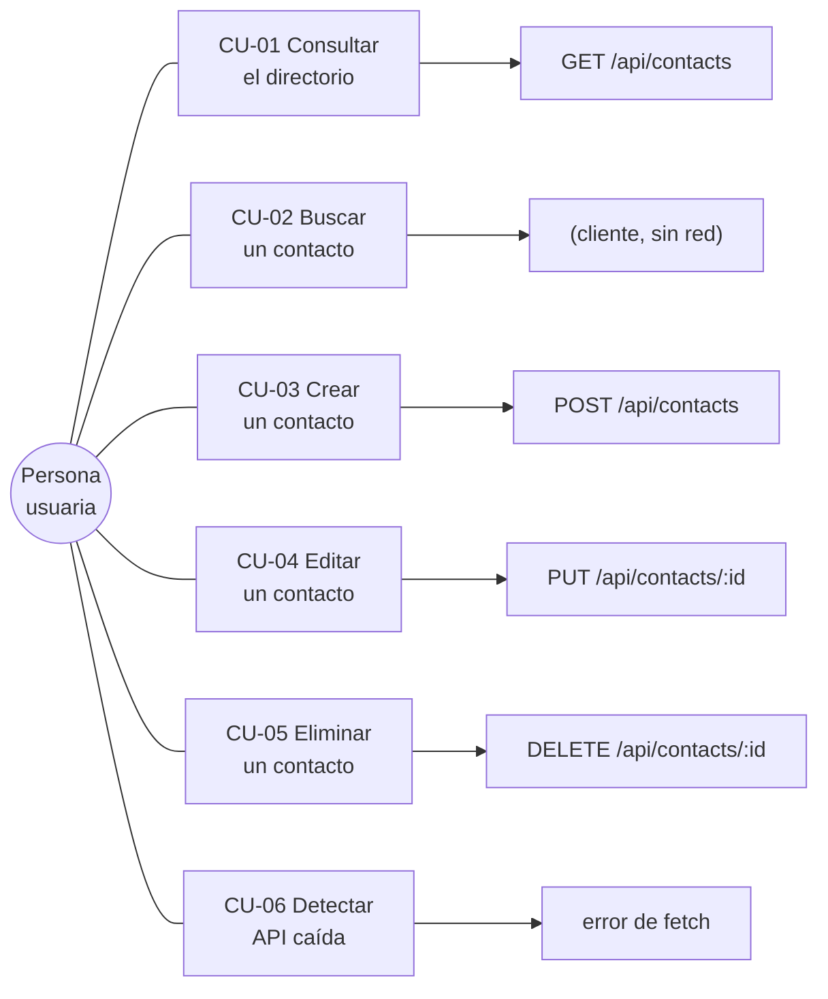

# Casos de uso

Seis flujos soportados hoy. Cada uno enlaza con el endpoint que lo respalda en [[Contrato de API]].

## CU-01 · Consultar el directorio

**Disparador:** abrir la app.
**Flujo:** al montar, [[App estado]] llama a `listContacts()` → `GET /api/contacts`. Mientras responde se muestran tres esqueletos; al llegar, tarjetas ordenadas por nombre (`COLLATE NOCASE`, ver [[Módulo contacts]]).
**Alternos:** lista vacía → *"Aún no hay contactos. Crea el primero en el formulario."* · error → banner de CU-06.
**Dato visible:** el contador de la cabecera muestra el total **sin filtrar**.

## CU-02 · Buscar un contacto

**Disparador:** escribir en el input de búsqueda.
**Flujo:** filtrado **en cliente** (`useMemo`) sobre `nombre + email + cargo`, sin distinguir mayúsculas. Cero peticiones.
**Alterno:** sin coincidencias → *"Nadie coincide con esa búsqueda."*
**Límite:** no busca en `telefono` ni `notas`.

## CU-03 · Crear un contacto

**Precondición:** el formulario está en modo creación (`editing === null`).
**Flujo:** enviar → `POST` con los cinco campos → el backend valida y normaliza ([[Validación y normalización]]) → 201 con el contacto creado → la UI **re-lista** desde la API ([[ADR-003 Refrescar la lista tras cada mutación]]) → toast *"Contacto creado"* → formulario limpio.
**Alternos:**
- Datos inválidos → 400, errores por campo pintados bajo cada input.
- Email ya existente → 409, *"Ese email ya está registrado"* bajo el campo email. Ver [[Reglas de negocio]].

## CU-04 · Editar un contacto

**Disparador:** botón lápiz en una tarjeta.
**Flujo:** `startEdit()` copia el contacto al formulario, el panel pasa a *"Editar a Camila Herrera"*, la tarjeta se marca activa. Enviar → `PUT /api/contacts/:id` → re-lista → toast *"Contacto actualizado"* → sale del modo edición.
**Alternos:** 404 si el contacto ya no existe · 409 si el nuevo email pertenece a otra persona · *Cancelar* descarta los cambios (`cancelEdit()`).
**Detalle:** el `PUT` es un reemplazo completo; los campos omitidos se guardan vacíos.

## CU-05 · Eliminar un contacto

**Disparador:** botón papelera.
**Flujo:** se marca `pendingDelete` y aparece un modal *"¿Quitar a X del directorio? Esta acción no se puede deshacer."* → confirmar → `DELETE` → 204 → re-lista → toast *"Contacto eliminado"*.
**Regla fina:** si se estaba editando justo a esa persona, la edición se cancela sola para no dejar un formulario apuntando a un registro muerto.
**Alterno:** cancelar cierra el modal sin tocar nada.

## CU-06 · Detectar que la API no responde

**Disparador:** el primer `GET` falla.
**Flujo:** banner con el mensaje del error más *"¿Está corriendo el backend en el puerto 3001?"* y un botón **Reintentar** que recarga la página.
**Por qué importa:** es el fallo más frecuente en desarrollo (levantar solo una de las dos apps). Ver [[Entorno de desarrollo]].

Relacionado: [[Diagrama de secuencia]], [[Estados de la UI]], [[Reglas de negocio]].
