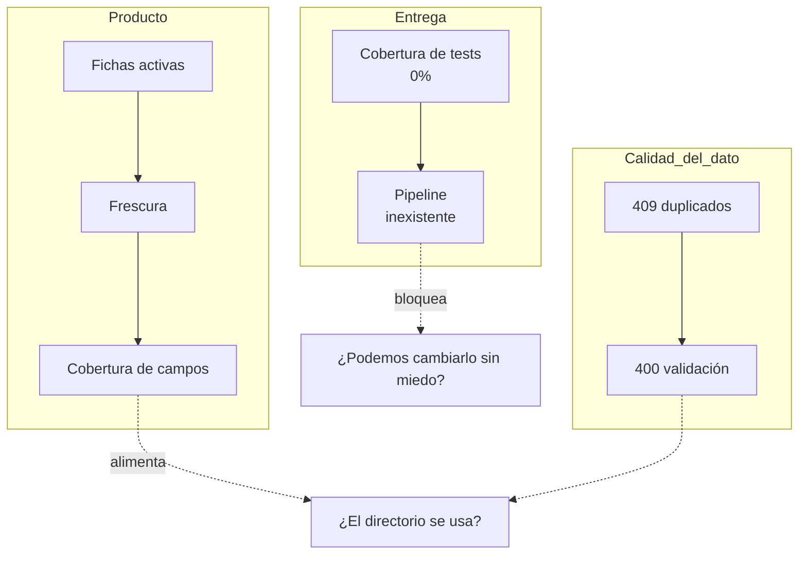

# Métricas y KPIs

> [!warning] Nada de esto está instrumentado
> El proyecto no emite telemetría ni tiene logging estructurado. Esta nota define **qué mediríamos** si Archivo pasara a uso real, para que la instrumentación no se improvise. Ver [[Roadmap y backlog]].

## Métricas de producto

| Métrica | Definición | Por qué importa | Señal de alarma |
|---|---|---|---|
| **Fichas activas** | Filas en `contacts` | Es el único número que la UI ya muestra (cabecera) | Cae en seco → alguien borró de más (RN-08 es irreversible) |
| **Frescura del directorio** | Mediana de días desde `updated_at` | Un directorio viejo deja de consultarse | Mediana > 180 días |
| **Cobertura de campos** | % de fichas con `cargo` y `telefono` no vacíos | Mide si el directorio sirve para algo más que el email | < 60 % |
| **Altas por mes** | `created_at` agrupado | Refleja si el equipo lo adoptó | 0 dos meses seguidos |
| **Ratio consulta/edición** | Lecturas ÷ mutaciones | Un directorio sano se lee mucho más de lo que se escribe | < 5:1 sugiere que se usa como formulario, no como directorio |

## Métricas de calidad del dato

- **Intentos de duplicado** — respuestas 409 por semana. Alto = la gente no busca antes de crear; la UI podría avisar mientras se escribe el email.
- **Tasa de validación fallida** — 400 ÷ total de mutaciones. Alto = los mensajes de [[Validación y normalización]] no se entienden.
- **Búsquedas sin resultado** — hoy solo existe en el cliente; medirla diría qué campos falta indexar (`notas`, `telefono`).

## Métricas técnicas

| Métrica | Objetivo razonable | Dónde se mediría |
|---|---|---|
| Latencia `GET /api/contacts` | p95 < 50 ms | SQLite local y síncrono: cualquier cosa por encima señala un problema de proceso, no de base |
| Disponibilidad de `/api/health` | > 99 % | [[Servidor Express]] |
| Errores 500 | 0 | El handler final de Express es el único que los produce |
| Tiempo de build del frontend | < 10 s | [[Build y despliegue]] |

## Métricas de entrega (las que faltan y más duelen)

Dado que el repo se llama `exampleCICD`, estas son las que justifican el nombre:

- **Cobertura de tests** — hoy **0 %**, sin framework instalado.
- **Duración del pipeline** — no existe pipeline. Ver [[CI-CD]].
- **Cambios fallidos** / **tiempo de restauración** — sin despliegue, sin medida.

Relacionado: [[Visión de producto]], [[Riesgos y deuda técnica]], [[CI-CD]].
