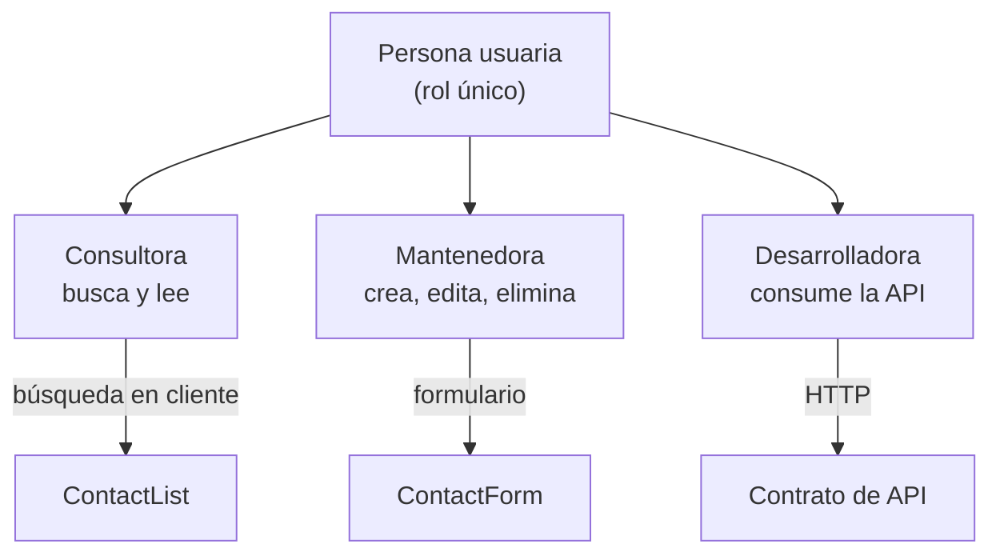

# Personas y usuarios

Archivo no tiene roles ni permisos: **toda persona que abre la app puede hacer todo**. Lo que cambia entre perfiles es la *intención*, no el permiso. Esa decisión está justificada en [[Seguridad]].

## Consultora — "¿cuál era su correo?"

- **Frecuencia:** varias veces al día, sesiones de segundos.
- **Necesidad:** encontrar a alguien por nombre, email o cargo sin pensar.
- **Cómo la sirve el producto:** un solo input filtra en cliente sobre esos tres campos (ver [[ContactList]]). No hay latencia de red porque la lista ya está en memoria.
- **Fricción conocida:** no busca en `notas` ni en `telefono`. Está en el [[Roadmap y backlog]].

## Mantenedora — "entró alguien nuevo"

- **Frecuencia:** semanal o menos.
- **Necesidad:** dar de alta, corregir un dato, dar de baja a quien salió.
- **Cómo la sirve el producto:** el mismo panel derecho sirve para crear y editar; el título cambia a "Editar a *Nombre*". Al borrar, un modal confirma porque la acción es irreversible.
- **Garantía que espera:** no crear un duplicado por accidente. La base lo impide y la API responde 409 con un mensaje dirigido al campo email.

## Desarrolladora — "necesito los contactos en otra herramienta"

- **Frecuencia:** puntual.
- **Necesidad:** leer y escribir contactos desde fuera de la UI.
- **Cómo la sirve el producto:** una API REST estable y documentada en [[Contrato de API]], con `/api/health` para comprobar que está viva.
- **Limitación real:** CORS solo admite `localhost:5173`. Cualquier otro origen necesita cambiar [[Servidor Express]].

## Momentos de verdad

| Momento | Lo que la persona siente | Dónde se juega |
|---|---|---|
| Primer arranque | "Esto ya tiene datos, entiendo la forma" | Semilla de 4 contactos, [[Módulo db]] |
| Escribe un email repetido | "Me avisó antes de romper algo" | 409 + error bajo el campo |
| Backend caído | "Sé qué pasa y qué hacer" | Banner con "¿Está corriendo el backend en el puerto 3001?" |
| Pulsa eliminar | "Puedo echarme atrás" | Modal de confirmación |

Relacionado: [[Casos de uso]], [[Visión de producto]], [[Estados de la UI]].
