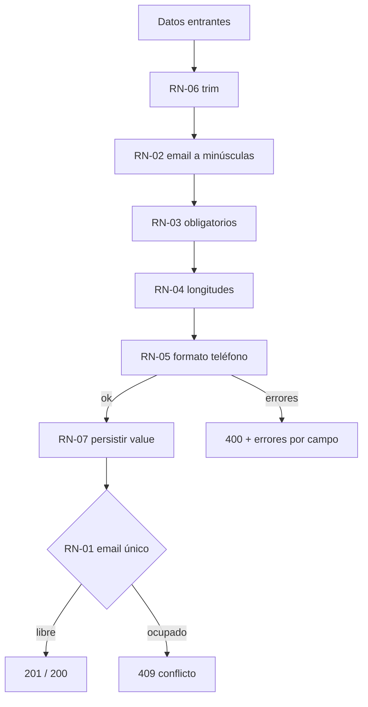

# Reglas de negocio

Invariantes del dominio *contacto*. Todas se aplican **en el servidor**; el navegador nunca es la última palabra.

## RN-01 · El email identifica a la persona

Restricción `UNIQUE` en la columna `email` ([[Modelo de datos]]). Dos contactos no pueden compartirlo.
Al violarse: **HTTP 409** con `errors.email = "Ese email ya está registrado"`.
Mecanismo de detección: [[ADR-005 Conflicto de email detectado por texto]].

## RN-02 · El email se guarda en minúsculas

`Camila@Halcyn.co` y `camila@halcyn.co` son **la misma persona**. La normalización a minúsculas ocurre antes de tocar la base, así que RN-01 se cumple de verdad y no solo en apariencia. Ver [[Validación y normalización]].

## RN-03 · Nombre y email son obligatorios

Todo lo demás (teléfono, cargo, notas) es opcional y se persiste como cadena vacía si no se envía.

## RN-04 · Límites de longitud

| Campo | Límite | Mensaje |
|---|---|---|
| `nombre` | 80 | "Máximo 80 caracteres" |
| `email` | 120 | "Máximo 120 caracteres" |
| `cargo` | 80 | "Máximo 80 caracteres" |
| `notas` | 280 | "Máximo 280 caracteres" |

280 en `notas` es intencional: una nota es un recordatorio, no un expediente.

## RN-05 · Formato del teléfono

Si se envía, debe cumplir `^[0-9+\s().-]{7,24}$` — dígitos, espacios, `+`, paréntesis, punto y guion, entre 7 y 24 caracteres. No se valida el país ni se normaliza el formato: el directorio acepta cómo el equipo ya escribe sus números.

## RN-06 · Todo dato se recorta

Espacios al inicio y al final se eliminan en los cinco campos. `"  "` equivale a vacío, así que un nombre de solo espacios falla RN-03.

## RN-07 · Nunca se persiste el input crudo

Las rutas guardan el objeto `value` que devuelve el validador, jamás `req.body`. Es la regla que hace que RN-02 y RN-06 sean ciertas sin excepciones. Ver [[Módulo contacts]].

## RN-08 · El borrado es definitivo

No hay papelera ni borrado lógico. Por eso la UI exige confirmación explícita (CU-05 en [[Casos de uso]]).

## RN-09 · Las marcas de tiempo las pone el servidor

`created_at` se fija al insertar; `updated_at` se reescribe en cada `PUT`. Ambas en ISO-8601 UTC. El cliente no puede alterarlas: no forman parte del payload aceptado.

## RN-10 · El directorio nunca arranca vacío

Si la tabla está vacía al iniciar, se siembran 4 contactos de ejemplo. Es una decisión de *producto* (que la primera pantalla enseñe la forma del dato), no un artefacto de pruebas. Ver [[Módulo db]].

Relacionado: [[Contrato de errores]], [[Modelo de datos]], [[Glosario]].
