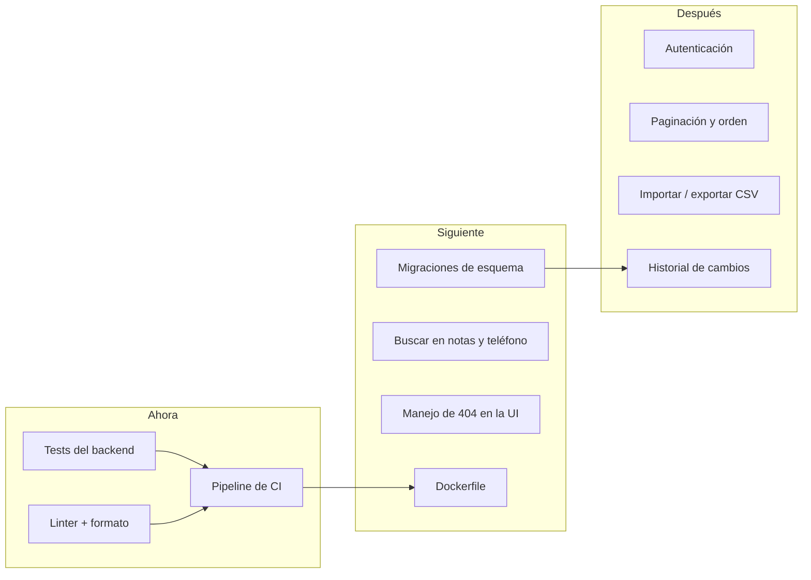

# Roadmap y backlog

Priorizado por **riesgo que elimina**, no por vistosidad. El criterio: primero lo que permite cambiar el código sin miedo, después lo que mejora el producto.

## Ahora — desbloquea todo lo demás

| # | Ítem | Por qué primero |
|---|---|---|
| 1 | **Tests del backend** ([[Validación y normalización]] y [[Contrato de API]]) | `validate.js` es puro y determinista: es el mejor retorno por línea de test. Sin esto, cualquier refactor es a ciegas. |
| 2 | **Pipeline de CI** | El repo se llama `exampleCICD` y no tiene ninguno. Ver [[CI-CD]] para el diseño propuesto. |
| 3 | **Linter y formato** | No hay ESLint ni Prettier; el estilo actual es consistente por disciplina, no por herramienta. |

## Siguiente — deuda que ya se nota

| # | Ítem | Detalle |
|---|---|---|
| 4 | **Migraciones de esquema** | Hoy el único camino para cambiar la tabla es borrar `backend/data/archivo.db`. Ver [[ADR-001 node sqlite sin ORM]]. |
| 5 | **Buscar en `notas` y `telefono`** | Petición natural de la [[Personas y usuarios|consultora]]; una línea en el `useMemo` de [[App estado]]. |
| 6 | **404 en la UI** | Si otra pestaña borra un contacto, editarlo devuelve 404 y hoy solo sale un toast genérico. |
| 7 | **Dockerfile / compose** | Levantar las dos apps con un comando. Ver [[Build y despliegue]]. |
| 8 | **Índice en `nombre`** | El `ORDER BY nombre COLLATE NOCASE` no usa índice. Irrelevante ahora, barato después. |

## Después — producto, no plomería

| # | Ítem | Condición previa |
|---|---|---|
| 9 | **Autenticación** | Obligatoria antes de cualquier despliegue fuera de localhost. Ver [[Seguridad]]. |
| 10 | **Paginación y orden configurable** | Se vuelve necesario a partir de unos cientos de fichas: hoy `GET /` devuelve todo. |
| 11 | **Importar/exportar CSV** | El camino realista de adopción es "traer la hoja de cálculo que ya existe". Exige decidir la política de duplicados frente a RN-01. |
| 12 | **Historial de cambios** | Hoy solo hay `updated_at`, sin diff. Depende de #4. |
| 13 | **Borrado lógico** | Suavizaría RN-08, que es irreversible. |

## Explícitamente descartado

- **Multi-tenancy** — cambia el modelo de datos entero para un caso que no existe.
- **Framework de estado (Redux, Zustand)** — [[App estado]] cabe en una pantalla; añadirlo sería ceremonia.
- **ORM** — decidido en [[ADR-001 node sqlite sin ORM]].

Relacionado: [[Riesgos y deuda técnica]], [[Métricas y KPIs]], [[Visión de producto]].
