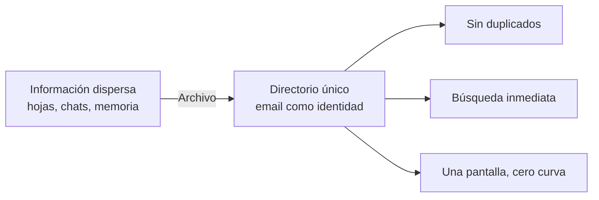

# Visión de producto

## El problema

Un equipo pequeño necesita una **fuente única de verdad** sobre quién es quién: nombre, correo, teléfono, cargo y un contexto breve. Hoy esa información vive dispersa en hojas de cálculo, hilos de chat y la memoria de alguien. El costo no es grande pero es constante: duplicados, correos mal escritos, "¿quién era el de operaciones?".

## La propuesta

Archivo es un **directorio de contactos de una sola pantalla**. Todo cabe en dos paneles: la lista con buscador a la izquierda, el formulario a la derecha. Sin navegación, sin login, sin pasos intermedios.

## Principios de diseño

1. **El email es la identidad.** Una persona, un registro. Lo garantiza la base, no la buena voluntad. Ver [[Reglas de negocio]].
2. **Escribir debe costar menos que buscar.** El mismo formulario crea y edita; no hay pantalla de detalle.
3. **Nada se pierde en silencio.** Cada mutación confirma con un toast; cada borrado pide confirmación explícita.
4. **Errores en el campo, no en un cartel.** La API devuelve errores por campo y la UI los pinta donde ocurren. Ver [[Contrato de errores]].
5. **Frontend y backend son reemplazables por separado.** Solo comparten el [[Contrato de API]].

## Alcance actual

✅ CRUD completo de contactos · búsqueda en cliente · validación por campo · estado vacío y de carga · confirmación de borrado.

## Fuera de alcance (deliberado)

| No hay | Por qué |
|---|---|
| Autenticación | Es un ejemplo de arquitectura, no un producto desplegado. Ver [[Seguridad]]. |
| Multiusuario / tenancy | Una sola base local, un solo directorio. |
| Paginación | Un equipo pequeño cabe en una lista. Se vuelve deuda a los ~500 registros: ver [[Riesgos y deuda técnica]]. |
| Historial de cambios | Solo se guarda `updated_at`, no el diff. |
| Importar/exportar | Candidato de [[Roadmap y backlog]]. |

## Señal de madurez pendiente

El repositorio se llama **`exampleCICD`** y no tiene tests, linter ni pipeline. La brecha entre el nombre y el contenido está documentada en [[CI-CD]] — es el primer trabajo del roadmap.

Relacionado: [[Personas y usuarios]], [[Casos de uso]], [[Métricas y KPIs]], [[Arquitectura general]].
