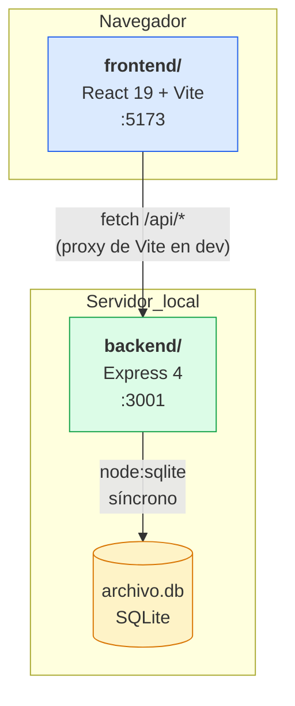
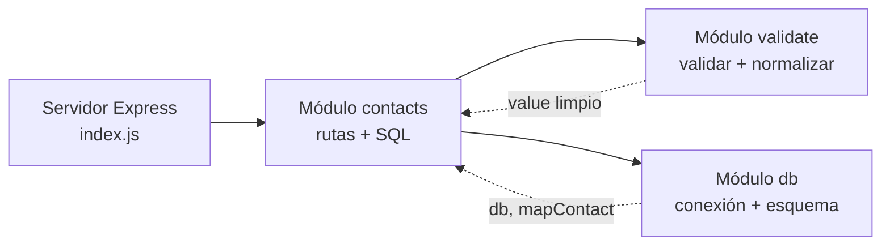
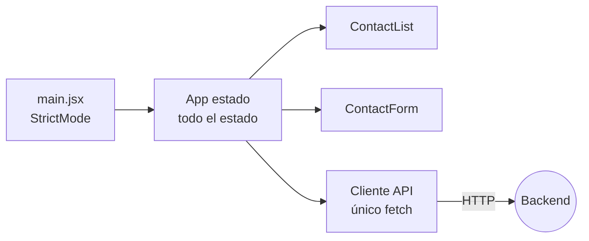

# Arquitectura general

Dos aplicaciones npm **independientes**, sin workspace raíz, que solo se conocen a través de HTTP.

## Las dos mitades

| | [[Frontend Web]] | [[Backend API]] |
|---|---|---|
| Carpeta | `frontend/` | `backend/` |
| Paquete | `archivo-web` | `archivo-api` |
| Stack | React 19, Vite 6 | Express 4, `node:sqlite` |
| Puerto | 5173 | 3001 |
| Dependencias de runtime | `react`, `react-dom` | `express`, `cors` |
| Estado | En memoria, efímero | SQLite en disco |

Ninguna importa código de la otra. El único acoplamiento es el [[Contrato de API]] — y eso es intencional ([[ADR-002 Dos proyectos sin monorepo]]).

## Cómo se conectan en desarrollo

El frontend pide a rutas **relativas** (`/api/contacts`, ver [[Cliente API]]). Vite proxea `/api` → `http://localhost:3001`. Así el código del navegador no conoce ninguna URL absoluta y funciona igual en producción si algo sirve ambos bajo el mismo origen.

Aun así, el backend habilita CORS para `localhost:5173` y `127.0.0.1:5173`, que cubre el acceso directo sin proxy. Detalle en [[Seguridad]].

## Capas del backend

Tres reglas sostienen esta forma:

1. **`db.js` tiene efectos al importarse** — crea la carpeta, abre la base, ejecuta el `CREATE TABLE`, siembra. Importarlo *es* inicializar. Por eso `index.js` hace `import "./db.js"` sin usar nada de él.
2. **Los statements se preparan una vez** a nivel de módulo en `contacts.js` ([[ADR-004 Statements preparados a nivel de módulo]]).
3. **La validación es una sola puerta** — `validate.js` valida *y* normaliza en la misma pasada, y devuelve el valor limpio que se persiste.

## Capas del frontend

`App.jsx` es el único componente con estado; `ContactList` y `ContactForm` son presentacionales y controlados por props. `api.js` es la única capa que hace `fetch` y traduce errores HTTP en un `Error` con `.errors`, listo para pintarse campo a campo.

## Lo que esta arquitectura compra y lo que cuesta

**Compra:** cero build en el backend, cero dependencias de base de datos, arranque instantáneo, el frontend se puede reescribir sin tocar la API.
**Cuesta:** dos `npm install`, dos procesos, sin migraciones, y SQLite síncrono bloquea el event loop (aceptable a esta escala; ver [[Riesgos y deuda técnica]]).

Relacionado: [[Flujo de datos]], [[Diagrama de contexto]], [[Entorno de desarrollo]].
