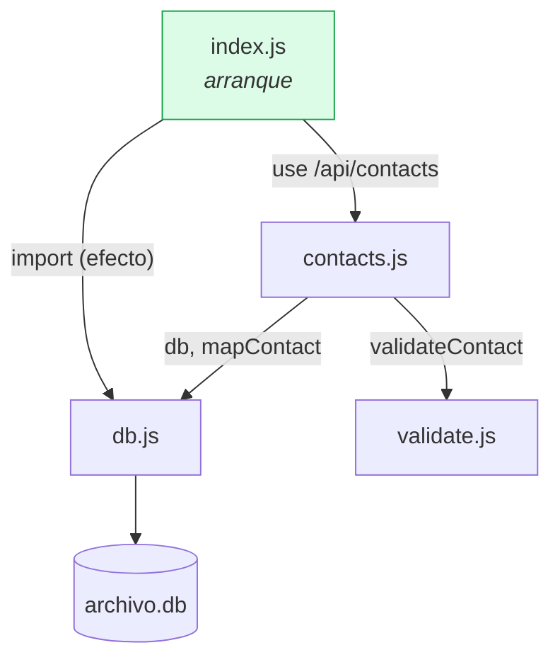

# Backend API

Paquete `archivo-api`. Express 4 sobre `node:sqlite`, **sin paso de build** y con solo dos dependencias de runtime: `express` y `cors`.

## Requisito duro: Node 22.5+

`node:sqlite` es el módulo integrado de Node; no hay driver externo ni binario que compilar. Los scripts arrancan con `--experimental-sqlite` y `package.json` declara `"node": ">=22.5.0"`. En una versión menor la app no arranca: falla el `import` de `node:sqlite`.

```bash
npm run dev    # node --watch --experimental-sqlite src/index.js
npm start      # sin watch
```

## Estructura

| Archivo | Responsabilidad | Nota |
|---|---|---|
| `src/index.js` | Servidor, CORS, JSON, montaje del router, handler de errores | [[Servidor Express]] |
| `src/db.js` | Conexión, esquema, semilla, `mapContact` | [[Módulo db]] |
| `src/contacts.js` | Rutas CRUD y los statements SQL | [[Módulo contacts]] |
| `src/validate.js` | Validación y normalización | [[Módulo validate]] |



## Decisiones que definen el backend

- **Sin ORM ni query builder** — SQL literal en statements preparados. [[ADR-001 node sqlite sin ORM]]
- **Statements preparados una sola vez**, al cargar el módulo. [[ADR-004 Statements preparados a nivel de módulo]]
- **El conflicto de email se detecta leyendo el mensaje del error**, no un código. [[ADR-005 Conflicto de email detectado por texto]]
- **Nunca se persiste `req.body`** — siempre el `value` normalizado. Ver [[Reglas de negocio]] RN-07.
- **Errores con forma única** `{ error, errors }`. Ver [[Contrato de errores]].

## Superficie expuesta

`GET /api/health` → `{ ok: true, service: "archivo-api" }` — sonda de vida, sin tocar la base.
`/api/contacts` → CRUD completo, detallado en [[Contrato de API]].

## Comportamiento síncrono

`DatabaseSync` es **bloqueante**: cada consulta detiene el event loop. Con un directorio de equipo y consultas por clave primaria el costo es de microsegundos y a cambio desaparece toda la asincronía del código de rutas. Es un trade-off consciente, anotado en [[Riesgos y deuda técnica]].

Relacionado: [[Arquitectura general]], [[Modelo de datos]], [[Seguridad]].
