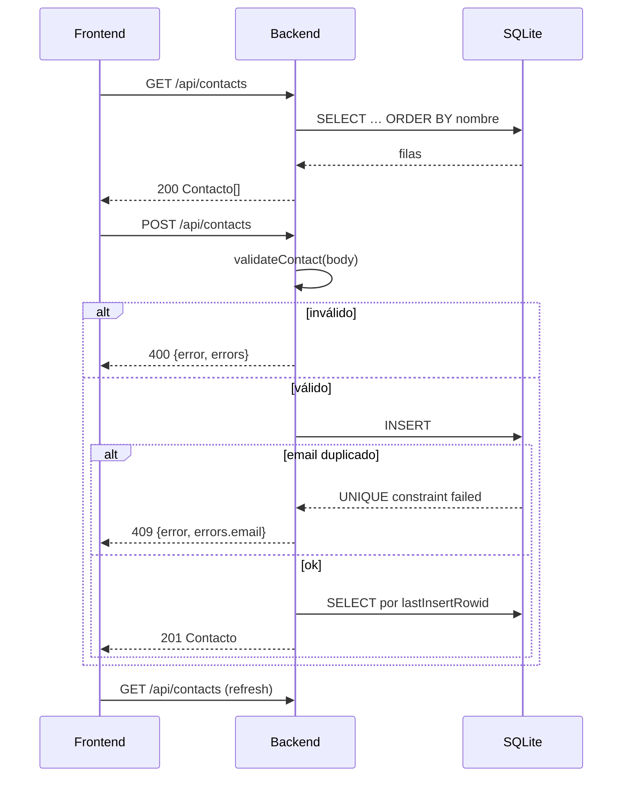

# Contrato de API

Base: `http://localhost:3001`. En desarrollo el frontend usa rutas relativas y Vite proxea. Todo es JSON; el body máximo es **32 kB**.

| Método | Ruta | Éxito | Errores |
|---|---|---|---|
| `GET` | `/api/health` | 200 | — |
| `GET` | `/api/contacts` | 200 `Contacto[]` | 500 |
| `GET` | `/api/contacts/:id` | 200 `Contacto` | 404 |
| `POST` | `/api/contacts` | 201 `Contacto` | 400, 409 |
| `PUT` | `/api/contacts/:id` | 200 `Contacto` | 400, 404, 409 |
| `DELETE` | `/api/contacts/:id` | 204 sin cuerpo | 404 |

Toda respuesta de error sigue la forma de [[Contrato de errores]].

## El recurso `Contacto`

```json
{
  "id": 1,
  "nombre": "Camila Herrera",
  "email": "camila.herrera@halcyn.co",
  "telefono": "+57 310 482 1190",
  "cargo": "Product Manager",
  "notas": "Coordina el roadmap del directorio interno.",
  "createdAt": "2026-09-17T12:00:00.000Z",
  "updatedAt": "2026-09-17T12:00:00.000Z"
}
```

Los campos opcionales llegan como **`""`, nunca `null`** ([[Modelo de datos]]). `createdAt` y `updatedAt` son de solo lectura: enviarlos no tiene efecto.

## Payload de escritura

`POST` y `PUT` aceptan exactamente estos cinco campos; cualquier otro se ignora:

```json
{ "nombre": "…", "email": "…", "telefono": "…", "cargo": "…", "notas": "…" }
```

`nombre` y `email` son obligatorios. Ver [[Reglas de negocio]].

## GET /api/health

```json
{ "ok": true, "service": "archivo-api" }
```

No toca la base: confirma que el proceso responde, no que SQLite esté sano.

## GET /api/contacts

Devuelve **todos** los contactos ordenados por `nombre` sin distinguir mayúsculas (`COLLATE NOCASE`). Sin paginación, sin filtros, sin parámetros de query — la búsqueda ocurre en el cliente ([[ContactList]]).

## POST /api/contacts

201 con el contacto ya creado (leído de vuelta por su `lastInsertRowid`, así que incluye `id` y marcas de tiempo reales).
400 si la validación falla · 409 si el email ya existe.

## PUT /api/contacts/:id

**Reemplazo completo, no parcial.** Los campos que no envíes se guardan vacíos. El orden importa: primero comprueba existencia (404), después valida (400), después intenta escribir (409). Actualiza `updated_at`; `created_at` queda intacto.

## DELETE /api/contacts/:id

204 sin cuerpo. Si `changes === 0`, 404. Irreversible (RN-08).

## Secuencia típica de la UI



## Probar a mano

```bash
curl localhost:3001/api/health
curl localhost:3001/api/contacts
curl -X POST localhost:3001/api/contacts \
  -H 'Content-Type: application/json' \
  -d '{"nombre":"Ana Ruiz","email":"ana@halcyn.co","cargo":"QA"}'
curl -X DELETE localhost:3001/api/contacts/5 -i
```

Relacionado: [[Backend API]], [[Cliente API]], [[Diagrama de secuencia]], [[Seguridad]].
