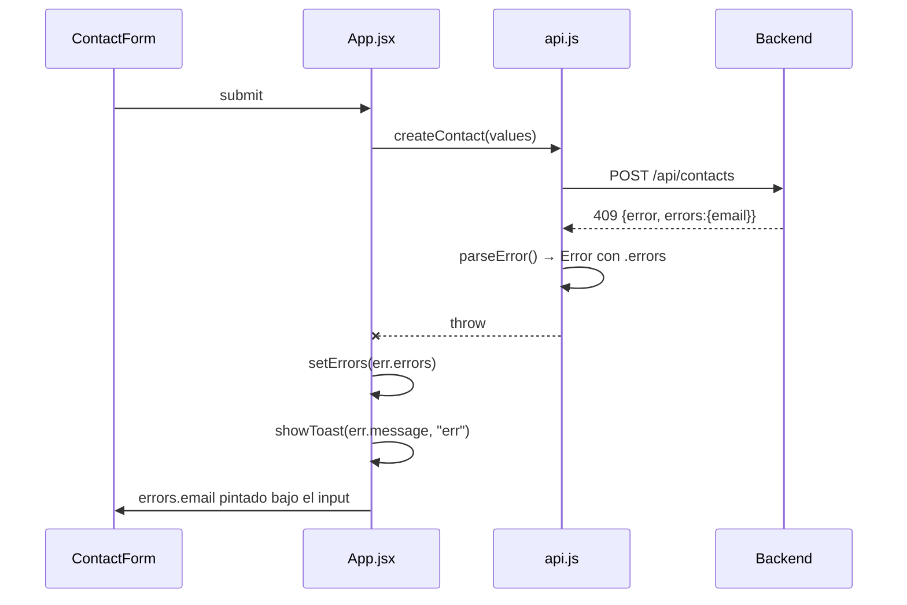

# Contrato de errores

Una sola forma para todos los errores de la API. Es lo que permite que el frontend pinte cada mensaje **bajo el campo que lo causó** sin lógica de traducción.

```json
{
  "error": "mensaje para la persona",
  "errors": { "campo": "mensaje específico" }
}
```

`error` siempre está. `errors` solo cuando el problema es atribuible a campos concretos.

## Catálogo

| Código | Cuándo | `error` | `errors` |
|---|---|---|---|
| **400** | Validación fallida | `"Revisa los campos del formulario"` | uno por campo inválido |
| **404** | El `id` no existe | `"Contacto no encontrado"` | — |
| **409** | Email ya registrado | `"Ya existe un contacto con ese email"` | `{ email: "Ese email ya está registrado" }` |
| **500** | Cualquier excepción no capturada | `"Error interno del servidor"` | — |

El 500 lo emite el handler final de [[Servidor Express]], que además loguea el error real en consola. El cliente nunca ve el stack.

## El viaje de un error



Dos canales, dos propósitos:
- **`errors` → el campo.** Preciso, accionable, persiste hasta que se corrige.
- **`error` → el toast.** Resumen efímero (2.8 s) de que algo falló.

## Lado cliente

`parseError()` en [[Cliente API]] convierte cualquier respuesta no-ok en un `Error` con la propiedad `.errors`. Si el cuerpo no es JSON parseable, degrada a `new Error("La petición falló")` con `.errors` indefinido — y [[App estado]] hace `setErrors(err.errors || {})`, así que la UI nunca revienta por una respuesta rara.

> [!info] Detalle del `try/catch`
> `parseError` lanza desde dentro de su propio `try`; el `catch` distingue por la presencia de `.errors` para no tragarse el error rico que acaba de construir. Es deliberado, aunque de lectura poco obvia.

## Lo que este contrato no cubre todavía

- **Fallo de red** (backend apagado): `fetch` rechaza antes de que haya respuesta. Lo maneja el banner de CU-06 en [[Casos de uso]], no este contrato.
- **404 durante una edición**: llega como toast genérico; la UI no saca al usuario del modo edición. Ítem #6 del [[Roadmap y backlog]].
- **429 / límites de tasa**: no existen. Ver [[Seguridad]].

Relacionado: [[Contrato de API]], [[Validación y normalización]], [[ADR-005 Conflicto de email detectado por texto]].
