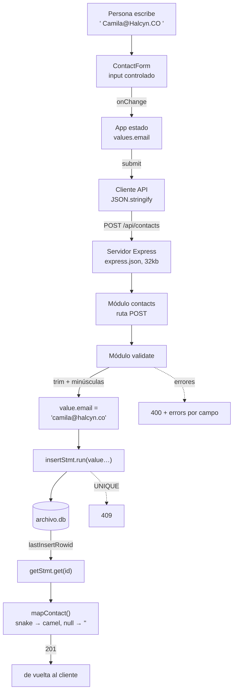
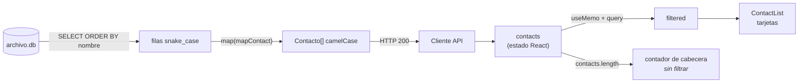
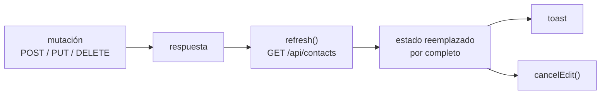

# Flujo de datos

El recorrido completo de un dato, de la tecla al disco y de vuelta.

## Escritura: de la tecla a SQLite

Tres transformaciones que conviene tener presentes:

1. **`trim` + minúsculas** en el validador — el dato cambia de forma aquí, no antes.
2. **`value`, nunca `req.body`** — lo que entra no es lo que se guarda (RN-07).
3. **`mapContact`** — lo que sale de la base no es lo que ve el cliente.

## Lectura: de SQLite a la pantalla

El orden lo decide **SQLite** (`ORDER BY nombre COLLATE NOCASE`), el filtro lo decide **el navegador**. El contador de la cabecera lee `contacts`, no `filtered`: buscar no cambia el número de fichas activas.

## El ciclo completo de una mutación

La respuesta de la mutación **se descarta**: la app no la usa para actualizar el estado, vuelve a pedir la lista entera. Dos peticiones por cambio a cambio de cero divergencia entre lo que se ve y lo que hay en disco. Razonado en [[ADR-003 Refrescar la lista tras cada mutación]].

## Dónde puede romperse

| Punto | Fallo | Se ve como |
|---|---|---|
| `fetch` | backend caído | banner "¿Está corriendo el backend en el puerto 3001?" |
| `express.json` | body > 32 kB | 500 genérico |
| validador | dato inválido | 400 + error bajo el campo |
| `INSERT`/`UPDATE` | email duplicado | 409 bajo el campo email |
| `getStmt` | id inexistente | 404 |
| `refresh()` | falla tras mutar | el toast dice ok pero la lista queda vieja — ver [[Riesgos y deuda técnica]] |

Relacionado: [[Arquitectura general]], [[Diagrama de secuencia]], [[Contrato de errores]].
