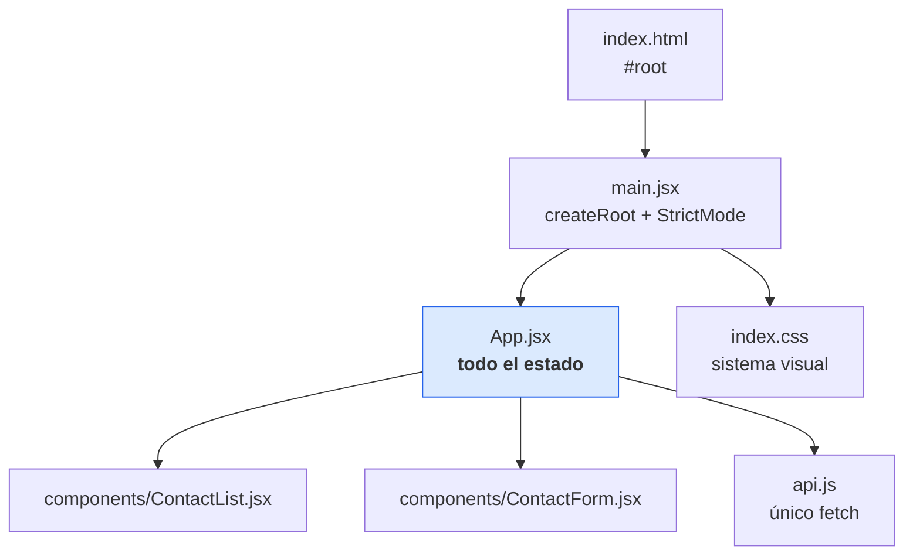

# Frontend Web

Paquete `archivo-web`. React 19 + Vite 6. **Sin router, sin librería de estado, sin framework CSS.**

## Qué NO hay (y por qué)

| Ausente | Razón |
|---|---|
| Router | Una sola pantalla. No hay a dónde navegar. |
| Redux / Zustand / Context | Todo el estado cabe en diez `useState` dentro de [[App estado]]. |
| Librería de formularios | Cinco campos controlados y errores que ya vienen del servidor por campo. |
| Tailwind / UI kit | CSS plano en `src/index.css`, con un sistema propio de clases. Ver [[Sistema visual]]. |
| Cliente HTTP (axios…) | `fetch` nativo, encapsulado en [[Cliente API]]. |

Esa ausencia es el punto: la app entera se lee en una tarde.

## Estructura



- [[App estado]] — estado, efectos, handlers y layout
- [[ContactList]] — buscador, esqueletos, estado vacío, tarjetas
- [[ContactForm]] — los cinco campos y sus errores
- [[Cliente API]] — `fetch` + traducción de errores
- [[Sistema visual]] — clases `liquid-glass`, `panel`, `card`, `toast`

## Patrón central: un formulario, dos modos

`editing` (el contacto o `null`) decide si el panel derecho crea o edita. No hay dos componentes ni dos rutas: hay una variable. `cancelEdit()` es el reset y se llama tanto al cancelar como al terminar de guardar. Ver [[Estados de la UI]].

## Patrón central: releer en vez de reconciliar

Después de crear, editar o borrar, la app llama a `refresh()` y **re-lista desde la API** en vez de parchear el array local. Cuesta una petición extra y elimina toda una clase de bugs de sincronización. Ver [[ADR-003 Refrescar la lista tras cada mutación]].

## Proxy de desarrollo

`vite.config.js` proxea `/api` → `http://localhost:3001`. El código del navegador solo usa rutas relativas, así que nunca hay una URL de backend embebida en el bundle.

## Build

```bash
npm run build     # → frontend/dist/
npm run preview   # sirve el dist (sin proxy: necesita el backend en el mismo origen)
```

> [!note] `frontend/dist/` está versionado
> Hay un build commiteado en el repo. Conviene decidir si se ignora o se regenera en el pipeline: ver [[Build y despliegue]].

Relacionado: [[Arquitectura general]], [[Contrato de errores]], [[Casos de uso]].
