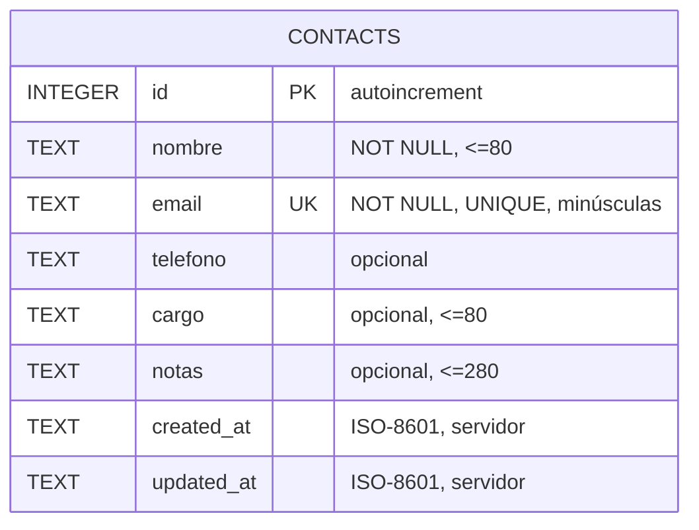
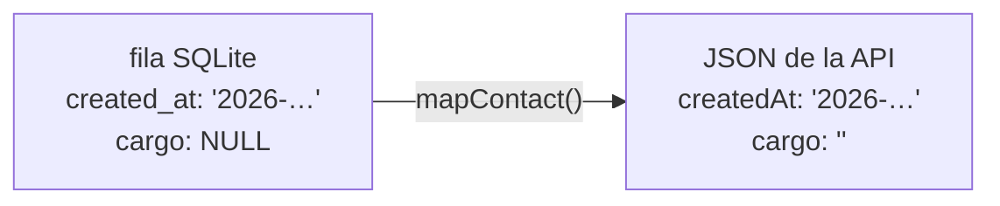

# Modelo de datos

Una sola tabla, una sola entidad. Sin relaciones, sin claves foráneas.

## Tabla `contacts`

```sql
CREATE TABLE IF NOT EXISTS contacts (
  id         INTEGER PRIMARY KEY AUTOINCREMENT,
  nombre     TEXT NOT NULL,
  email      TEXT NOT NULL UNIQUE,
  telefono   TEXT,
  cargo      TEXT,
  notas      TEXT,
  created_at TEXT NOT NULL,
  updated_at TEXT NOT NULL
)
```

| Columna | Tipo | Nulo | Regla | Origen |
|---|---|---|---|---|
| `id` | INTEGER PK | no | autoincremental | SQLite |
| `nombre` | TEXT | no | obligatorio, ≤ 80 | cliente, normalizado |
| `email` | TEXT | no | obligatorio, **único**, minúsculas, ≤ 120 | cliente, normalizado |
| `telefono` | TEXT | sí | patrón de teléfono si viene | cliente, normalizado |
| `cargo` | TEXT | sí | ≤ 80 | cliente, normalizado |
| `notas` | TEXT | sí | ≤ 280 | cliente, normalizado |
| `created_at` | TEXT | no | ISO-8601 UTC, inmutable | **servidor** |
| `updated_at` | TEXT | no | ISO-8601 UTC, se reescribe en cada `PUT` | **servidor** |

Las reglas completas están en [[Reglas de negocio]]; dónde se aplican, en [[Validación y normalización]].

## Entidad



Ver también [[Modelo ER]] con el ciclo de vida.

## Dos formas del mismo dato

La base usa `snake_case`; la API habla `camelCase`. `mapContact()` es la frontera entre ambos mundos y hace tres cosas:

1. Renombra `created_at` → `createdAt`, `updated_at` → `updatedAt`.
2. Convierte `NULL` en `""`, para que el frontend nunca reciba `null` en un input controlado.
3. Devuelve `null` si la fila no existe, que es lo que las rutas usan para decidir el 404.



Está en `backend/src/db.js`. Cualquier columna nueva debe pasar por ahí o no llegará al cliente.

## Ciclo de vida del archivo de base

- Ruta: `backend/data/archivo.db`, creada al importar [[Módulo db]].
- **Está en `.gitignore`**: cada clon arranca con base propia.
- Si la tabla está vacía, se siembran 4 contactos (RN-10).

## Cambiar el esquema

No hay migraciones. El procedimiento real hoy:

1. Editar el `CREATE TABLE` en `backend/src/db.js`.
2. Actualizar `mapContact()`.
3. Actualizar los statements de [[Módulo contacts]] y el validador.
4. **Borrar `backend/data/archivo.db`** y reiniciar.

El paso 4 destruye datos: aceptable en local, inviable en cualquier entorno compartido. Es el ítem #4 del [[Roadmap y backlog]] y la consecuencia asumida en [[ADR-001 node sqlite sin ORM]].

## Índices

Solo los implícitos: clave primaria y `UNIQUE(email)`. El `ORDER BY nombre COLLATE NOCASE` hace un scan + sort. Irrelevante con decenas de filas; anotado en [[Riesgos y deuda técnica]].

Relacionado: [[Backend API]], [[Contrato de API]], [[Glosario]].
