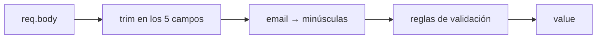

# Validación y normalización

`backend/src/validate.js` es la **única puerta** por la que pasa todo dato que llega del exterior. Una función pura, sin dependencias, sin acceso a base: `validateContact(body)`.

## Firma

```js
const { ok, errors, value } = validateContact(req.body);
```

| Campo devuelto | Qué es |
|---|---|
| `ok` | `true` si `errors` está vacío |
| `errors` | mapa `campo → mensaje`, listo para el [[Contrato de errores]] |
| `value` | los cinco campos **ya normalizados** — lo único que se persiste |

Que valide *y* normalice en la misma pasada es el punto: no existe un momento intermedio en que el dato esté validado pero sucio.

## Normalización (ocurre siempre, incluso si hay errores)



- `trim()` convierte `null`/`undefined` en `""` vía `String(value ?? "")`, así que un body incompleto no rompe nada.
- El email baja a minúsculas **antes** de validarse y de guardarse. Sin esto, la restricción `UNIQUE` sería falsa en la práctica (RN-02 en [[Reglas de negocio]]).

## Reglas

| Campo | Validación | Mensaje |
|---|---|---|
| `nombre` | requerido | "El nombre es obligatorio" |
| | ≤ 80 | "Máximo 80 caracteres" |
| `email` | requerido | "El email es obligatorio" |
| | `/^[^\s@]+@[^\s@]+\.[^\s@]+$/` | "Escribe un email válido" |
| | ≤ 120 | "Máximo 120 caracteres" |
| `telefono` | si viene: `/^[0-9+\s().-]{7,24}$/` | "Usa un teléfono con dígitos, espacios o +" |
| `cargo` | ≤ 80 | "Máximo 80 caracteres" |
| `notas` | ≤ 280 | "Máximo 280 caracteres" |

Las comprobaciones de cada campo son excluyentes (`else if`): se devuelve **un** mensaje por campo, el primero que falla. Evita apilar tres errores sobre el mismo input.

El regex de email es deliberadamente laxo — "algo, arroba, algo, punto, algo". Validar direcciones con precisión es imposible; lo que importa es atrapar el error de dedo, no certificar que el buzón existe.

## Qué NO valida

- Que el email exista o sea entregable.
- Que el teléfono sea de un país real.
- **Unicidad** — eso lo decide la base de datos, no esta función. Ver [[ADR-005 Conflicto de email detectado por texto]].

## Por qué es la mejor candidata a tests

Pura, determinista, sin I/O, con toda la lógica de negocio del sistema concentrada dentro. Es el ítem #1 del [[Roadmap y backlog]]: casos obvios a cubrir son body vacío, espacios en blanco solamente, email en mayúsculas, longitudes en el borde exacto, teléfono con letras.

## Validación en el cliente

El formulario marca `required` en nombre y email pero usa `noValidate`, así que **el navegador no bloquea el envío**: la validación real siempre es la del servidor. Un solo lugar donde puede estar mal. Ver [[ContactForm]].

Relacionado: [[Módulo contacts]], [[Reglas de negocio]], [[Contrato de errores]].
