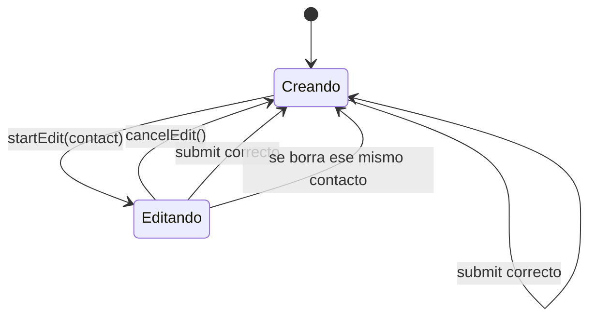

# App estado

`frontend/src/App.jsx` — el **único** componente con estado. Contiene el estado, los efectos, los handlers y el layout. [[ContactList]] y [[ContactForm]] no saben que existe una API.

## Los diez estados

| Estado | Tipo | Para qué |
|---|---|---|
| `contacts` | `Contacto[]` | la lista completa tal como la devolvió el servidor |
| `loading` | bool | primera carga → esqueletos |
| `error` | string | fallo de la carga inicial → banner |
| `query` | string | texto del buscador |
| `values` | objeto | los cinco campos del formulario |
| `errors` | objeto | errores por campo, vienen del servidor |
| `editing` | `Contacto \| null` | **decide el modo del formulario** |
| `submitting` | bool | deshabilita el botón, muestra "Guardando…" |
| `pendingDelete` | `Contacto \| null` | contacto esperando confirmación en el modal |
| `toast` | `{message, tone} \| null` | aviso efímero |

`editing` es la variable central: crear y editar no son dos pantallas, son un `null` o un objeto. Ver [[Estados de la UI]].

## Efectos

**Carga inicial** — `listContacts()` al montar; `.catch` llena `error`, `.finally` apaga `loading`.
**Autocierre del toast** — `setTimeout` de 2800 ms, con limpieza al desmontar o al cambiar de toast (evita que un toast viejo apague uno nuevo).

## Derivado: `filtered`

```js
const filtered = useMemo(() => {
  const needle = query.trim().toLowerCase();
  if (!needle) return contacts;
  return contacts.filter(c =>
    [c.nombre, c.email, c.cargo].join(" ").toLowerCase().includes(needle));
}, [contacts, query]);
```

Filtra **en cliente**, sin red. Solo sobre nombre, email y cargo — no busca en `notas` ni `telefono` ([[Roadmap y backlog]] #5).

El contador de la cabecera usa `contacts.length`, **no** `filtered.length`: buscar no cambia cuántas fichas hay.

## Handlers



- **`handleChange`** — actualiza el campo **y borra su error**: el mensaje desaparece al empezar a corregir.
- **`startEdit`** — copia los cinco campos del contacto a `values`, limpia errores.
- **`cancelEdit`** — el reset único: `editing = null`, `values = EMPTY`, `errors = {}`. Se usa al cancelar *y* al terminar de guardar.
- **`handleSubmit`** — `preventDefault`, `submitting = true`, crea o edita según `editing`, toast, **`refresh()`** ([[ADR-003 Refrescar la lista tras cada mutación]]), `cancelEdit()`. En el `catch`: `setErrors(err.errors || {})` + toast de error. `finally` siempre apaga `submitting`.
- **`confirmDelete`** — borra; **si se estaba editando justo a esa persona, cancela la edición** para no dejar el formulario apuntando a un registro muerto; refresca; toast; limpia `pendingDelete` en `finally`.

> [!warning] `refresh()` dentro del `try`
> Si la mutación tiene éxito pero el `GET` posterior falla, se entra al `catch` y se muestra un toast de error aunque el dato **sí** se guardó. Mensaje engañoso, poco probable en local. Anotado en [[Riesgos y deuda técnica]].

## Layout

```
header.topbar    → marca, lede, contador
banner           → solo si falló la carga inicial (con botón Reintentar)
main.layout      → ContactList | panel con ContactForm
modal            → solo si hay pendingDelete
toast            → solo si hay toast
```

Todo condicional usa el patrón `cond ? <jsx/> : null`. Clases del [[Sistema visual]].

Relacionado: [[Cliente API]], [[Casos de uso]], [[Frontend Web]].
