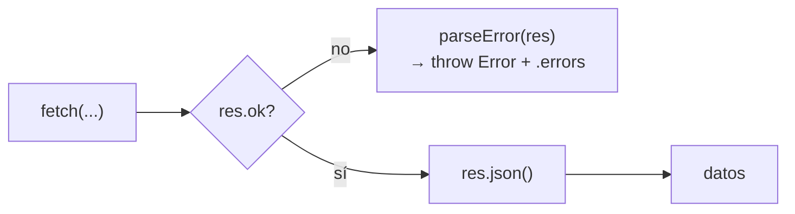

# Cliente API

`frontend/src/api.js` — **la única capa del frontend que hace `fetch`**. 44 líneas, sin dependencias.

## Superficie

```js
listContacts()            → Contacto[]
createContact(payload)    → Contacto
updateContact(id, payload)→ Contacto
deleteContact(id)         → undefined
```

Base: `const API = "/api/contacts"` — **relativa**. No hay ninguna URL de backend en el bundle; en desarrollo Vite proxea a `:3001` ([[Frontend Web]]).

## El valor real del módulo: `parseError`

```js
async function parseError(res) {
  try {
    const data = await res.json();
    const error = new Error(data.error || "La petición falló");
    error.errors = data.errors || {};
    throw error;
  } catch (error) {
    if (error.errors) throw error;
    throw new Error("La petición falló");
  }
}
```

Traduce el [[Contrato de errores]] del servidor a un `Error` de JavaScript con una propiedad extra `.errors` (mapa campo → mensaje). Gracias a eso, [[App estado]] puede hacer:

```js
catch (err) {
  setErrors(err.errors || {});   // → bajo cada input
  showToast(err.message, "err"); // → aviso efímero
}
```

Sin traducciones ni condicionales por código HTTP en la UI.

> [!info] El `try/catch` que parece un bug y no lo es
> `parseError` lanza **dentro** de su propio `try`, así que su `catch` recibe el error que acaba de construir. La comprobación `if (error.errors) throw error` lo distingue de un fallo real de `res.json()` (respuesta vacía o no-JSON) y lo relanza intacto. Es correcto, pero merece un comentario si alguien lo toca.

## Patrón uniforme



`deleteContact` es la excepción: en 204 no hay cuerpo, así que no llama a `res.json()` y devuelve `undefined`.

## Lo que no maneja

- **Fallo de red** (backend apagado): `fetch` rechaza antes de que exista `res`, así que `parseError` ni se ejecuta. Ese caso lo cubre el banner de [[App estado]] (CU-06 en [[Casos de uso]]).
- **Timeouts** — no hay `AbortController`. Una petición colgada deja el botón en "Guardando…" indefinidamente.
- **Reintentos** — ninguno, por diseño.

## Al añadir un endpoint

Respetar el patrón: `fetch` → `if (!res.ok) return parseError(res)` → `return res.json()`. Que *todo* fetch viva aquí es lo que mantiene la UI libre de detalles de transporte.

Relacionado: [[Contrato de API]], [[App estado]], [[Flujo de datos]].
