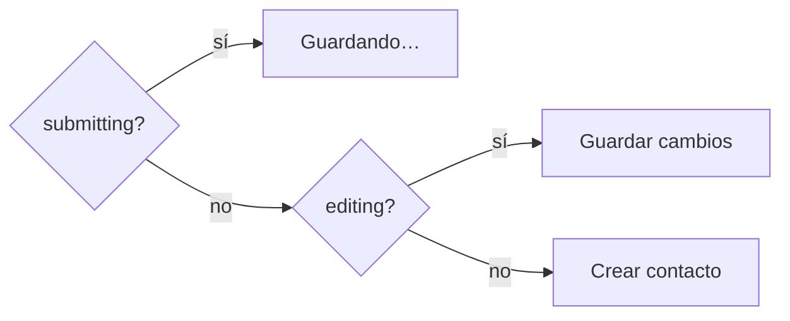

# ContactForm

`frontend/src/components/ContactForm.jsx` — presentacional puro. Sin `useState`, sin `fetch`, sin saber si crea o edita: recibe todo por props desde [[App estado]].

## Props

| Prop | Tipo | Efecto |
|---|---|---|
| `values` | objeto | valores de los cinco inputs controlados |
| `errors` | objeto | mensaje bajo cada campo + clase `has-error` |
| `editing` | bool | texto del botón y presencia de "Cancelar" |
| `submitting` | bool | deshabilita el botón, muestra "Guardando…" |
| `onChange` | fn | un solo handler para los cinco campos |
| `onSubmit` | fn | submit del `<form>` |
| `onCancel` | fn | solo visible en modo edición |

## Los cinco campos

| Campo | Control | `autoComplete` | Placeholder |
|---|---|---|---|
| Nombre | `input` `required` | `name` | Camila Herrera |
| Email | `input type=email` `required` | `email` | camila@halcyn.co |
| Teléfono | `input` | `tel` | +57 310 000 0000 |
| Cargo | `input` | — | Product Manager |
| Notas | `textarea` | — | Contexto breve para el equipo |

Cada uno sigue la misma plantilla:

```jsx
<div className={`field ${errors.x ? "has-error" : ""}`}>
  <label htmlFor="x">…</label>
  <input id="x" name="x" value={values.x} onChange={onChange} />
  {errors.x ? <span className="error">{errors.x}</span> : null}
</div>
```

El `name` del input coincide con la clave en `values`, en `errors` y con el campo de la API. Esa coincidencia es lo que permite un único `onChange` genérico (`event.target.name`) y que los errores del servidor se pinten solos. **Romper esa correspondencia rompe tres cosas a la vez.**

## `noValidate` — decisión, no descuido

```jsx
<form className="form" onSubmit={onSubmit} noValidate>
```

Los campos llevan `required` (semántica y accesibilidad) pero el navegador no bloquea el envío. La validación real es la del servidor ([[Validación y normalización]]), con mensajes en español y consistentes. Una sola fuente de verdad, en vez de dos sistemas que discrepan en el borde.

## El botón, tres textos



"Cancelar" (`btn-ghost`) solo aparece en modo edición: en modo creación no hay nada que cancelar.

## Accesibilidad

`label` con `htmlFor` en los cinco campos, `autoComplete` donde aplica, botón deshabilitado mientras se envía.
**Pendiente:** los `<span class="error">` no están asociados con `aria-describedby` ni el input marcado con `aria-invalid`, así que un lector de pantalla no anuncia el error al enfocar el campo. Mejora barata anotada en [[Riesgos y deuda técnica]].

## Al añadir un campo

Copiar el bloque `field`, usar el mismo `name` que en la API, y recordar los otros cuatro sitios listados en [[Módulo validate]].

Relacionado: [[App estado]], [[Sistema visual]], [[Contrato de errores]].
