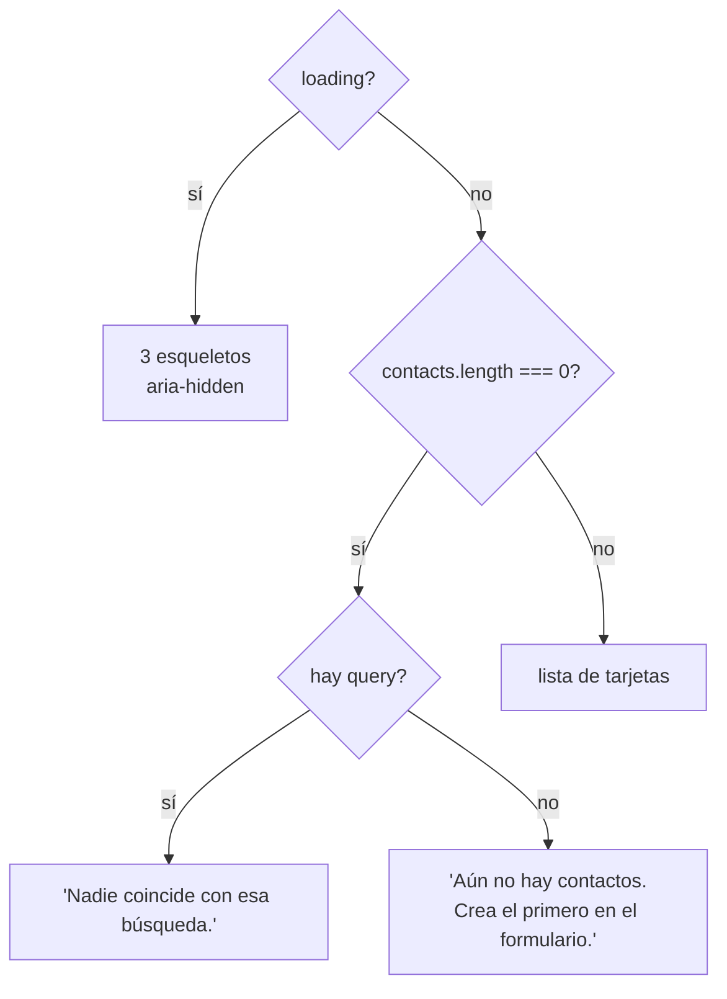

# ContactList

`frontend/src/components/ContactList.jsx` — el panel izquierdo: buscador y tarjetas. Presentacional; recibe la lista **ya filtrada** desde [[App estado]].

## Props

| Prop | Uso |
|---|---|
| `contacts` | la lista ya filtrada (`filtered`, no `contacts`) |
| `loading` | primera carga → esqueletos |
| `query` | valor del buscador (controlado por el padre) |
| `editingId` | marca la tarjeta en edición con `is-active` |
| `onQuery` | cambia el texto de búsqueda |
| `onEdit` | pide editar ese contacto |
| `onAskDelete` | pide **confirmación** de borrado, no borra |

`onAskDelete` no elimina nada: solo marca `pendingDelete` y el modal vive en el padre. Así este componente no puede provocar una pérdida de datos por sí solo.

## Tres estados mutuamente excluyentes



Dos vacíos distintos, dos mensajes distintos: "no encontré" y "todavía no hay" son problemas diferentes y la salida del usuario también.

## La tarjeta

```
avatar (iniciales)  ·  nombre / email / cargo  ·  ✏️  🗑️
```

- **`initials()`** — primeras letras de las dos primeras palabras del nombre, en mayúsculas. Tolera espacios extra (`filter(Boolean)`) y usa `part[0]?.` para no romperse con entradas raras.
- **`cargo`** solo se pinta si no está vacío — recuerda que la API devuelve `""`, nunca `null` ([[Modelo de datos]]).
- **`style={{ "--i": index }}`** — variable CSS que el [[Sistema visual]] usa para escalonar la animación de entrada de cada tarjeta.
- **`is-active`** cuando `editingId === contact.id`: conecta visualmente la tarjeta con el formulario de la derecha.
- **`key={contact.id}`** — id de la base, estable entre refrescos.

## Iconos

`PencilIcon` y `TrashIcon` son componentes SVG inline al final del archivo, con `stroke="currentColor"` para heredar el color del botón (incluida la variante `danger` de la papelera) y `aria-hidden` porque el texto accesible está en el botón.

## Accesibilidad

- Buscador con `aria-label="Buscar contactos"`.
- Botones con etiqueta contextual: `aria-label="Editar Camila Herrera"`, `aria-label="Eliminar Camila Herrera"` — un lector de pantalla no anuncia catorce botones idénticos.
- Esqueletos y SVG marcados `aria-hidden`.

Es la parte mejor resuelta del frontend en accesibilidad; [[ContactForm]] está un paso por detrás.

Relacionado: [[App estado]], [[Casos de uso]], [[Sistema visual]].
