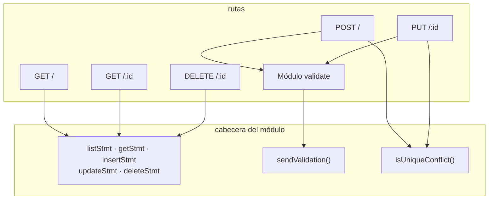

# Módulo contacts

`backend/src/contacts.js` — el router CRUD y **todo el SQL del sistema**. 112 líneas.

## Anatomía



Los cinco statements se preparan una vez, al cargar el módulo ([[ADR-004 Statements preparados a nivel de módulo]]).

## Las rutas

**`GET /`** — `listStmt.all().map(mapContact)`. Todo, ordenado por nombre sin distinguir mayúsculas. Una línea.

**`GET /:id`** — `Number(req.params.id)`, `mapContact` devuelve `null` si no hay fila → 404.

**`POST /`**
1. Validar → si falla, 400 con los errores por campo.
2. `now = new Date().toISOString()` para `created_at` **y** `updated_at`.
3. `insertStmt.run(value.…)` — siempre `value`, nunca `req.body` (RN-07).
4. **Releer** por `lastInsertRowid` y devolver 201 con el contacto real, no con lo que envió el cliente.
5. `catch`: si es conflicto único → 409; si no, `throw` y que lo recoja el handler final de [[Servidor Express]].

**`PUT /:id`** — mismo patrón, con un orden deliberado: **existencia primero** (404), después validación (400), después escritura (409). Preguntar por un contacto que no existe no debería devolver errores de formulario. Reemplazo completo: lo que no envías, se vacía.

**`DELETE /:id`** — `result.changes === 0` → 404; si no, 204 sin cuerpo.

## Los dos helpers

```js
function sendValidation(res, errors) {
  return res.status(400).json({ error: "Revisa los campos del formulario", errors });
}
```
Un solo sitio produce el 400, así que la forma del [[Contrato de errores]] no puede divergir entre rutas.

```js
function isUniqueConflict(error) {
  return typeof error?.message === "string" &&
         error.message.toLowerCase().includes("unique");
}
```
Detección por texto del mensaje. Es frágil y está razonado —con sus reservas— en [[ADR-005 Conflicto de email detectado por texto]].

## Patrones a respetar al editar este archivo

1. **Persistir `value`, jamás `req.body`.** Es lo que hace ciertas RN-02 y RN-06.
2. **Releer después de escribir.** El cliente recibe el estado real de la base, con marcas de tiempo e ids verdaderos.
3. **Existencia antes que validación** en las rutas con `:id`.
4. **Parámetros vinculados con `?`.** Nunca interpolar en el SQL. Ver [[Seguridad]].
5. **Errores desconocidos se relanzan.** No convertir todo en 400.

## Duplicación conocida

El bloque `catch` del 409 está repetido literalmente en `POST` y `PUT`. Extraerlo a un helper sería el refactor obvio — y hoy no hay tests que lo respalden ([[Roadmap y backlog]] #1).

Relacionado: [[Contrato de API]], [[Módulo db]], [[Validación y normalización]].
