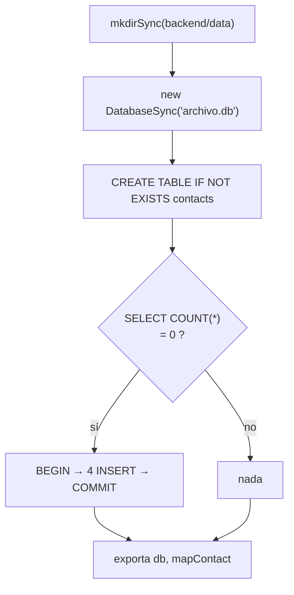

# Módulo db

`backend/src/db.js` — conexión, esquema, semilla y traducción de filas. **Importarlo tiene efectos secundarios**, y eso es el diseño, no un descuido.

## Al importarse, en orden



Por eso [[Servidor Express]] hace `import "./db.js"` sin usar el resultado, y por eso [[Módulo contacts]] puede preparar sus statements a nivel de módulo ([[ADR-004 Statements preparados a nivel de módulo]]): cuando se ejecuta, la tabla ya existe.

## Exporta

| Símbolo | Qué es |
|---|---|
| `db` | instancia `DatabaseSync` abierta sobre `backend/data/archivo.db` |
| `mapContact(row)` | fila snake_case → objeto camelCase de la API |

## La semilla

Cuatro contactos ficticios del dominio `halcyn.co` (Camila Herrera, Mateo Rivas, Lucía Andrade, Andrés Pineda), insertados en una transacción explícita (`BEGIN`/`COMMIT`) solo si la tabla está vacía.

Es una decisión de **producto**, no de pruebas: la primera pantalla enseña la forma del dato en vez de un estado vacío. Ver RN-10 en [[Reglas de negocio]].

Consecuencia práctica: **vaciar la tabla y reiniciar repuebla la semilla**. Si alguien borra todos los contactos a propósito, los cuatro de ejemplo reaparecen en el siguiente arranque. Anotado en [[Riesgos y deuda técnica]].

## `mapContact` — la frontera entre dos vocabularios

```js
telefono: row.telefono ?? "",
createdAt: row.created_at,
```

Tres comportamientos:
1. `snake_case` → `camelCase` en las marcas de tiempo.
2. `NULL` → `""`, para que React nunca reciba `null` en un input controlado.
3. Fila inexistente → `null`, que es como las rutas deciden el 404.

Toda columna nueva debe añadirse aquí o no llegará al cliente. Ver [[Modelo de datos]].

## Rutas y ciclo de vida del archivo

`__dirname` se reconstruye con `fileURLToPath(import.meta.url)` porque el paquete es ESM (`"type": "module"`). La base vive en `backend/data/archivo.db`, **ignorada por git**: cada clon arranca limpio.

Para reconstruir el esquema: parar el proceso, borrar el archivo, arrancar. No hay migraciones ([[ADR-001 node sqlite sin ORM]]).

Relacionado: [[Módulo contacts]], [[Backend API]], [[Modelo ER]].
