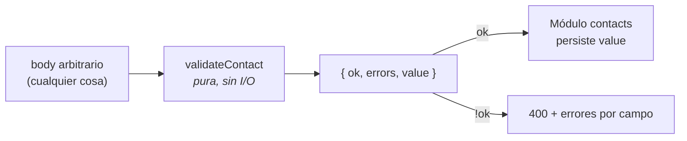

# Módulo validate

`backend/src/validate.js` — 35 líneas, **cero dependencias**, función pura. Concentra toda la lógica de negocio del sistema.

La descripción completa de reglas y normalización está en [[Validación y normalización]]; esta nota cubre el módulo como unidad de código.

## Superficie

```js
export function validateContact(body) → { ok, errors, value }
```

Nada más se exporta. `trim()`, `EMAIL_RE` y `PHONE_RE` son privados del módulo.

## Por qué es la pieza más valiosa del backend



- **Sin I/O, sin estado, sin reloj.** La misma entrada da siempre la misma salida.
- **Tolera basura.** `String(value ?? "").trim()` absorbe `undefined`, `null`, números y objetos sin lanzar. Un `POST` con `{}` devuelve errores limpios, no un 500.
- **Es la frontera de confianza.** Todo lo que pasa de aquí se considera seguro para escribir en la base.

## Contrato interno con las rutas

`value` **siempre** viene poblado, incluso cuando `ok` es `false`. Las rutas solo lo usan si `ok`, pero la función no obliga a ese orden: la disciplina está en [[Módulo contacts]], no aquí.

## Candidato número uno a tests

Sin mocks, sin servidor, sin base. Casos que anclarían el comportamiento:

| Caso | Esperado |
|---|---|
| `{}` | `errors.nombre` y `errors.email` |
| `{ nombre: "   " }` | nombre obligatorio (el trim lo vacía) |
| `{ email: "A@B.CO" }` | `value.email === "a@b.co"` |
| `nombre` de 81 caracteres | "Máximo 80 caracteres" |
| `nombre` de 80 exactos | válido |
| `telefono: "abc"` | error de formato |
| `telefono: ""` | válido (opcional) |
| `notas` de 281 | "Máximo 280 caracteres" |

Ver [[Roadmap y backlog]] #1 y [[CI-CD]].

## Al añadir un campo

1. Añadir `const campo = trim(body.campo)` y sus reglas.
2. Incluirlo en `value`.
3. Reflejarlo en el `CREATE TABLE` y en `mapContact` ([[Módulo db]]).
4. Añadirlo a los statements de [[Módulo contacts]].
5. Añadir el input en [[ContactForm]].

Cinco sitios, sin tipos que lo verifiquen: la consecuencia asumida en [[ADR-001 node sqlite sin ORM]].

Relacionado: [[Reglas de negocio]], [[Contrato de errores]].
