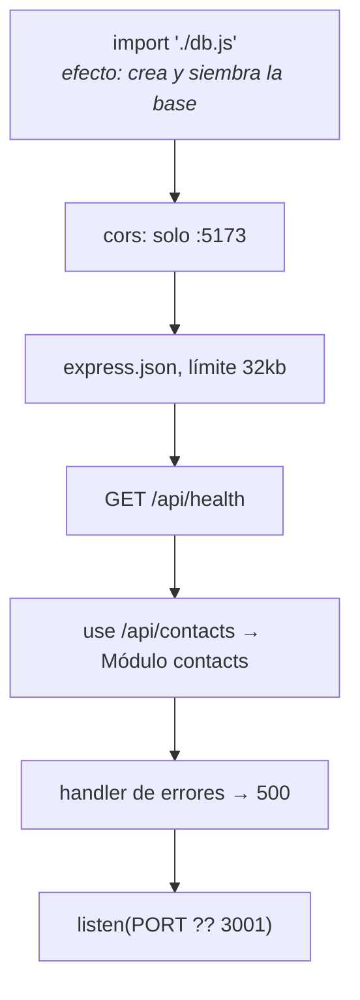

# Servidor Express

`backend/src/index.js` — 29 líneas. El arranque completo del [[Backend API]].

## Qué hace, en orden



## Los cuatro detalles que importan

**1. `import "./db.js"` sin usar nada**
No es un import muerto. [[Módulo db]] crea la carpeta `data/`, abre la base, ejecuta el `CREATE TABLE` y siembra al ser importado. Esta línea *es* la inicialización de la base. Borrarla porque "no se usa" rompe el arranque.

**2. CORS restringido**
```js
cors({ origin: ["http://localhost:5173", "http://127.0.0.1:5173"] })
```
Solo el frontend de desarrollo. Cualquier otro origen recibe un rechazo del navegador. Analizado en [[Seguridad]].

**3. Límite de 32 kB**
`express.json({ limit: "32kb" })`. Generoso frente al payload real (máximo teórico ~600 bytes según [[Reglas de negocio]]) y suficiente para evitar cuerpos absurdos. Un body mayor produce un error que cae en el handler final → **500**, no 413. Detalle anotado en [[Riesgos y deuda técnica]].

**4. Handler de errores final**
```js
app.use((err, _req, res, _next) => {
  console.error(err);
  res.status(500).json({ error: "Error interno del servidor" });
});
```
Loguea el error real y devuelve un mensaje genérico: el cliente nunca ve stacks ni rutas internas. Es la última red del [[Contrato de errores]].

> [!warning] Solo captura errores síncronos
> Express 4 no propaga rechazos de promesas al handler de errores. Aquí no es un problema porque toda la capa de datos es **síncrona** ([[ADR-001 node sqlite sin ORM]]): los `throw` de los handlers sí llegan. Si algún día se introduce un handler `async`, habrá que envolverlo o pasar a Express 5.

## Configuración

| Variable | Defecto | Uso |
|---|---|---|
| `PORT` | `3001` | `Number(process.env.PORT) || 3001` |

Es la única variable de entorno del proyecto. No hay `.env` ni `dotenv`.

## Health check

`GET /api/health` → `{ ok: true, service: "archivo-api" }`. No consulta la base: responde que el proceso está vivo. Suficiente como `healthcheck` de contenedor; ver [[Build y despliegue]].

Relacionado: [[Backend API]], [[Contrato de API]], [[Entorno de desarrollo]].
