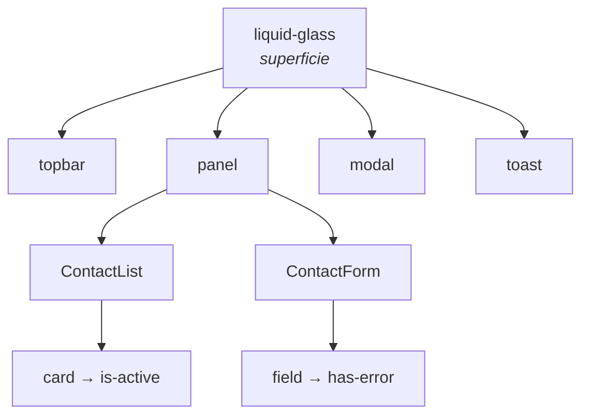

# Sistema visual

CSS plano en `frontend/src/index.css`. Sin Tailwind, sin CSS-in-JS, sin preprocesador. Un conjunto pequeño de clases que se reutilizan; **la regla del proyecto es reutilizarlas antes de inventar nuevas**.

## Vocabulario de clases

| Clase | Qué es | Dónde aparece |
|---|---|---|
| `liquid-glass` | superficie translúcida — la firma visual de la app | topbar, panel, modal, toast |
| `panel` | contenedor de sección con título y copy | lista y formulario |
| `card` | ficha de contacto; `is-active` cuando se está editando | [[ContactList]] |
| `toast` | aviso flotante efímero; tonos `ok` / `err` | [[App estado]] |
| `btn` | botón; variantes `btn-primary`, `btn-ghost` | formulario y modal |
| `icon-btn` | botón cuadrado de icono; variante `danger` | acciones de la tarjeta |
| `field` | grupo label+input; `has-error` al fallar | [[ContactForm]] |
| `error` | mensaje bajo un campo | [[ContactForm]] |
| `skeleton` | placeholder de carga | [[ContactList]] |
| `empty` | estado vacío | [[ContactList]] |
| `banner` | aviso persistente de API caída | [[App estado]] |
| `modal` / `modal-backdrop` | confirmación de borrado | [[App estado]] |
| `avatar` | círculo con iniciales | [[ContactList]] |
| `topbar` / `brand` / `eyebrow` / `lede` / `stat` | cabecera | [[App estado]] |
| `toolbar` / `search` | buscador | [[ContactList]] |

## Composición

Las clases se combinan, no se anidan: `className="panel liquid-glass"`, `className="btn btn-primary"`, `` className={`card ${isActive ? "is-active" : ""}`} ``. Una capa de estructura más una de superficie o variante.

## Animación escalonada

[[ContactList]] pasa `style={{ "--i": index }}` a cada tarjeta y el CSS usa esa variable como retardo, de modo que la lista entra en cascada. Si añades otra lista, reutiliza el mismo mecanismo en vez de crear uno nuevo.

## Convenciones al añadir estilos

1. Buscar primero si ya existe una clase que sirva.
2. Nombrar por **función**, no por apariencia (`is-active`, no `is-blue`).
3. Variantes como clase adicional (`btn btn-ghost`), no como clase nueva completa.
4. Estado con prefijo `is-` o `has-`.
5. Mantener el texto en español, igual que el resto de la UI.

Relacionado: [[Frontend Web]], [[Estados de la UI]], [[ContactForm]].
