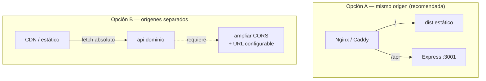

# Build y despliegue

> [!warning] Hoy no hay despliegue
> Archivo corre en local. Esta nota documenta lo que existe y **lo que habría que resolver** para desplegarlo. Ver también [[CI-CD]].

## Lo que existe

**Backend — sin build.** Node ejecuta el fuente directamente.
```bash
cd backend && npm ci && npm start   # node --experimental-sqlite src/index.js
```
Requisitos: Node 22.5+, escritura en `backend/data/` y persistencia de esa carpeta.

**Frontend — build estático con Vite.**
```bash
cd frontend && npm ci && npm run build   # → frontend/dist/
npm run preview                          # sirve el dist localmente
```

> [!note] `frontend/dist/` está versionado en git
> Hay un build commiteado. Conviene decidirlo explícitamente: o se ignora y lo genera el pipeline, o se acepta y se regenera en cada cambio. Mantenerlo a medias garantiza que algún día el `dist` no corresponda al fuente.

## Lo que falta resolver

**1. El proxy no existe en producción.** `/api` → `:3001` es una función del servidor de desarrollo de Vite. En producción hacen falta dos opciones:



La **A** conserva las rutas relativas de [[Cliente API]] sin tocar código y no necesita tocar CORS. La **B** obliga a introducir una variable de entorno con la URL de la API y a ampliar la lista de orígenes en [[Servidor Express]].

**2. Persistencia.** `backend/data/archivo.db` debe vivir en un volumen. En un contenedor sin volumen, cada despliegue borra el directorio y la semilla vuelve a insertarse: pérdida total y silenciosa.

**3. Esquema.** Sin migraciones, cambiar la tabla en producción no tiene un camino seguro. Bloqueante real; ítem #4 del [[Roadmap y backlog]].

**4. Autenticación.** No hay ninguna. Desplegar esto en una red accesible expone un CRUD abierto. Ver [[Seguridad]].

**5. Backups.** Un solo archivo SQLite: `sqlite3 archivo.db ".backup"` periódico resuelve el 90 % del problema, pero hoy no hay nada.

## Contenedor propuesto

Dos imágenes ([[ADR-002 Dos proyectos sin monorepo]]):

| Imagen | Base | Contenido | Healthcheck |
|---|---|---|---|
| `archivo-api` | `node:22-alpine` | `src/` + deps de producción, volumen en `/app/data` | `GET /api/health` |
| `archivo-web` | `nginx:alpine` | `dist/` + regla de proxy `/api` | `GET /` |

`/api/health` ya existe precisamente para esto.

Relacionado: [[Entorno de desarrollo]], [[CI-CD]], [[Riesgos y deuda técnica]].
