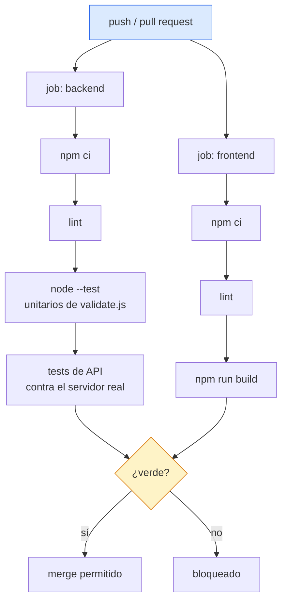

# CI-CD

> [!danger] El hueco del repositorio
> El repo se llama **`exampleCICD`** y **no tiene ni tests, ni linter, ni pipeline, ni hooks de git**. No hay carpeta `.github/`, ni `package.json` en la raíz, ni script de test en ninguno de los dos proyectos. Esta nota documenta el estado real y propone el camino mínimo.

## Estado actual

| Elemento | Estado |
|---|---|
| Tests | ❌ ninguno, sin framework instalado |
| Linter / formateo | ❌ ni ESLint ni Prettier |
| Pipeline (Actions, GitLab CI…) | ❌ no existe |
| Hooks de git | ❌ ninguno |
| Escaneo de dependencias | ❌ ninguno |
| Build reproducible | ⚠️ parcial: hay `package-lock.json` en ambos proyectos, pero `frontend/dist/` está commiteado |
| Versionado | ⚠️ ambos en 1.0.0, a mano |

Consecuencia directa: **cualquier cambio se valida ejecutando la app a mano.** Los riesgos concretos que esto deja sin red están en [[Riesgos y deuda técnica]] — en especial [[ADR-005 Conflicto de email detectado por texto]], que depende del texto de un mensaje de error de Node y no tiene nada que avise si cambia.

## Pipeline mínimo propuesto

Dos jobs paralelos, uno por proyecto, coherente con [[ADR-002 Dos proyectos sin monorepo]]:

Node **22.5+** en la matriz: es el mínimo del proyecto.

## Orden de implementación

**Paso 1 — tests unitarios de [[Módulo validate]].**
Con `node --test`, integrado: cero dependencias nuevas. Función pura, sin mocks. Es donde vive toda la lógica de negocio. Casos en la propia nota del módulo.

**Paso 2 — tests de API.**
Levantar el servidor sobre una base temporal y ejercitar el [[Contrato de API]] con `fetch`. Los imprescindibles:

| Test | Ancla |
|---|---|
| `POST` válido → 201 y el contacto devuelto | contrato |
| `POST` sin nombre → 400 con `errors.nombre` | [[Contrato de errores]] |
| `POST` con email repetido → **409** | **[[ADR-005 Conflicto de email detectado por texto]]** |
| `POST` con email en MAYÚSCULAS → se guarda en minúsculas | RN-02 |
| `PUT` de un id inexistente → 404 | contrato |
| `DELETE` dos veces → 204 y luego 404 | contrato |
| `GET /` ordenado por nombre sin distinguir mayúsculas | contrato |

Requiere poder apuntar la base a un archivo temporal; hoy la ruta está fija en [[Módulo db]]. Es el pequeño refactor que desbloquea este paso.

**Paso 3 — linter y formato.** ESLint + Prettier, misma config en ambos proyectos.

**Paso 4 — build del frontend en CI** y decisión sobre `frontend/dist/` ([[Build y despliegue]]).

**Paso 5 — despliegue.** Solo tiene sentido después de resolver persistencia, migraciones y autenticación.

## Puertas de calidad sugeridas

- CI verde obligatorio para fusionar a `main`.
- Cobertura sin umbral al principio; el objetivo es que exista, no que sea alta.
- `npm audit` informativo, no bloqueante: cuatro dependencias directas en total.

Relacionado: [[Roadmap y backlog]], [[Métricas y KPIs]], [[Entorno de desarrollo]].
