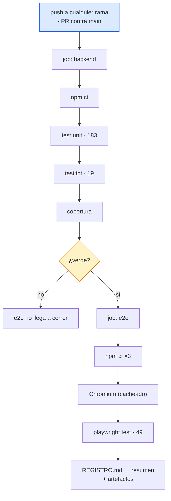

# CI-CD

> [!success] El hueco principal está cerrado
> El repo se llama **`exampleCICD`** y durante mucho tiempo no tuvo ni tests ni pipeline. Hoy tiene **251 pruebas en tres capas** y un workflow de GitHub Actions que las corre en cada push. Sigue faltando linter y despliegue.

## Estado actual

| Elemento | Estado |
|---|---|
| Tests | ✅ 251 en tres capas — ver [[Estrategia de pruebas]] |
| Pipeline (GitHub Actions) | ✅ `.github/workflows/ci.yml`, dos jobs |
| `package.json` en la raíz | ✅ orquesta los tres proyectos; `npm test` corre todo |
| Cobertura | ✅ publicada como artefacto; 100 % en los tres módulos de `src/` salvo `index.js` |
| Reporte de pruebas | ✅ `e2e/REGISTRO.md`, trazable caso de uso → prueba |
| Linter / formateo | ❌ ni ESLint ni Prettier |
| Hooks de git | ❌ ninguno |
| Escaneo de dependencias | ❌ ninguno |
| Build del frontend en CI | ❌ no se compila |
| Despliegue | ❌ no existe |
| Build reproducible | ⚠️ hay `package-lock.json` en los tres proyectos, pero `frontend/dist/` sigue commiteado |

## El pipeline

Node **22** en ambos jobs: `node:sqlite` exige 22.5+.

### Decisiones del workflow

- **`e2e` depende de `backend`.** Si la API no pasa, la app no puede funcionar: no vale la pena arrancar un navegador.
- **Los servidores los levanta Playwright**, no el workflow. `playwright.config.js` tiene `reuseExistingServer: !process.env.CI`: en local reutiliza lo que ya esté corriendo, en CI arranca backend y frontend él mismo.
- **`concurrency` con `cancel-in-progress`**: un push nuevo cancela la corrida anterior de la misma rama.
- **Navegadores en caché** por hash de `e2e/package-lock.json`.
- **`cache-dependency-path` explícito** en el job de e2e: el `package.json` de la raíz solo orquesta y no tiene lock propio, así que sin esas rutas `setup-node` busca uno en la raíz y el job muere antes de instalar nada. Fue el primer fallo real del pipeline.

### Artefactos

| Artefacto | Contenido |
|---|---|
| `cobertura-backend` | reporte de cobertura de Jest |
| `reporte-e2e` | HTML navegable de Playwright, `junit.xml`, `REGISTRO.md`, y capturas, vídeo y traza de los fallos |

Además, `REGISTRO.md` se vuelca en el resumen de la corrida: el estado por caso de uso se lee desde la propia página del workflow, sin descargar nada.

## Lo que queda

**Paso 1 — linter y formato.** ESLint + Prettier con la misma config en los tres proyectos, y un job que los corra. Es el ítem #3 del [[Roadmap y backlog]] y el único hueco grande de calidad que sigue abierto.

**Paso 2 — build del frontend en CI** y decisión sobre `frontend/dist/`, hoy commiteado ([[Build y despliegue]]).

**Paso 3 — `npm audit`** informativo, no bloqueante: cuatro dependencias directas en total.

**Paso 4 — despliegue.** Solo tiene sentido después de resolver persistencia, migraciones y autenticación ([[Seguridad]]).

## Puertas de calidad

- CI verde obligatorio para fusionar a `main` — **pendiente de activar** en la configuración del repositorio; el workflow ya da la señal.
- Cobertura sin umbral: el objetivo era que existiera, y ya existe.

Relacionado: [[Estrategia de pruebas]], [[Roadmap y backlog]], [[Métricas y KPIs]], [[Entorno de desarrollo]].
