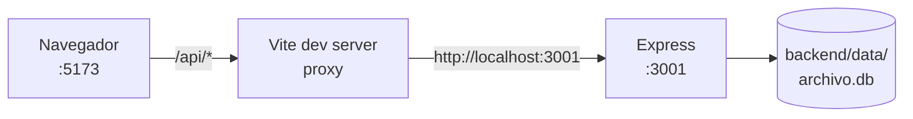

# Entorno de desarrollo

## Requisito previo

**Node.js 22.5 o superior.** No es negociable: [[Backend API]] usa `node:sqlite`, integrado desde esa versión. Con una menor, el `import` falla y el servidor no arranca.

```bash
node --version   # debe ser >= v22.5.0
```

## Arranque

Son **dos proyectos independientes** ([[ADR-002 Dos proyectos sin monorepo]]): dos `npm install`, dos terminales, y **ambos procesos deben estar vivos**.

```bash
# terminal 1 — API en http://localhost:3001
cd backend
npm install
npm run dev        # node --watch: recarga al guardar

# terminal 2 — UI en http://localhost:5173
cd frontend
npm install
npm run dev
```

Abrir **http://localhost:5173**. Vite proxea `/api` → `:3001`, así que el navegador solo habla con un origen.



## Comprobar que está sano

```bash
curl localhost:3001/api/health     # {"ok":true,"service":"archivo-api"}
curl localhost:3001/api/contacts   # 4 contactos sembrados en el primer arranque
```

## Problemas frecuentes

| Síntoma | Causa | Solución |
|---|---|---|
| Banner *"¿Está corriendo el backend en el puerto 3001?"* | solo se levantó el frontend | arrancar la terminal 1 |
| `ERR_UNKNOWN_BUILTIN_MODULE: node:sqlite` | Node < 22.5 | actualizar Node |
| `EADDRINUSE :3001` | otro proceso ocupa el puerto | `PORT=3002 npm run dev` y ajustar el proxy en `vite.config.js` |
| Error de CORS al llamar sin proxy | origen no permitido | usar `:5173`, o añadirlo en [[Servidor Express]] |
| Cambio de esquema sin efecto | la tabla ya existía (`IF NOT EXISTS`) | parar, borrar `backend/data/archivo.db`, arrancar |
| Reaparecen los 4 contactos de ejemplo | se vació la tabla y se reinició | comportamiento esperado: RN-10 en [[Reglas de negocio]] |

## Reiniciar la base

```bash
rm backend/data/archivo.db   # con el servidor parado
```

Al arrancar, [[Módulo db]] recrea el esquema y siembra. Es el único mecanismo de "migración" que existe ([[ADR-001 node sqlite sin ORM]]).

## Qué no hay

- Sin `.env` ni `dotenv` — la única variable es `PORT`.
- Sin Docker — ítem #7 del [[Roadmap y backlog]].
- **Sin tests, linter ni hooks de git.** Ver [[CI-CD]].

Relacionado: [[Arquitectura general]], [[Build y despliegue]], [[Contrato de API]].
