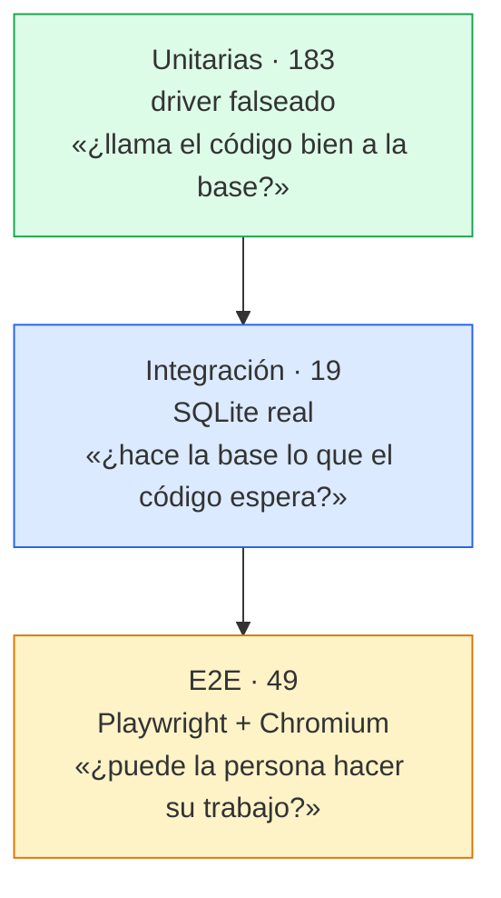

# Estrategia de pruebas

251 pruebas en tres capas, cada una respondiendo a una pregunta distinta. La regla que las ordena: **si algo puede probarse en la capa más barata, se prueba ahí**; las de arriba existen solo para lo que las de abajo no pueden demostrar.



| Capa | Ubicación | Entorno | Coste |
|---|---|---|---|
| Unitarias | `backend/tests/*.test.js` | `node:sqlite` falseado | milisegundos |
| Integración | `backend/tests/*.int.test.js` | SQLite **real** en archivo temporal | decenas de ms |
| E2E | `e2e/tests/cu-0X-*.spec.js` | Chromium contra `:5173` + `:3001` | ~1 s por prueba |

## Comandos

```bash
npm run instalar     # dependencias de los tres proyectos
npm test             # las tres capas en orden
npm run test:unit    # solo unitarias
npm run test:int     # solo integración
npm run test:e2e     # solo end-to-end
npm run reporte      # e2e/REGISTRO.md
```

## Unitarias — se falsea el driver, no `db.js`

`db.js` hace su trabajo **al importarse** y `contacts.js` prepara sus cinco statements al cargar ([[ADR-004 Statements preparados a nivel de módulo]]): importar cualquier módulo de `src/` toca disco.

Mockear `db.js` entero obligaría a reimplementar `mapContact` dentro del test, y un test que copia la lógica de producción no prueba nada. Por eso se falsea **`node:sqlite`**: el código real de [[Módulo db]] y [[Módulo contacts]] se ejecuta de verdad, sin tocar disco. El doble responde `{ total: 4 }` al conteo para que la siembra no corra.

Cobertura: **100 %** de [[Módulo contacts]], [[Módulo validate]] y [[Módulo db]]. `index.js` queda a 0 % porque llama a `app.listen()` al importarse — se arreglaría extrayendo un `createApp()` exportable.

## Integración — driver real, ubicación redirigida

`db.js` calcula su ruta desde `import.meta.url` y no hay variable de entorno que la mueva, así que importarlo tal cual **escribiría en la base de desarrollo de quien corre la suite**. La solución no es falsear el driver, sino subclasar `DatabaseSync` para ignorar la ruta que pide `db.js` y abrir un archivo temporal. El motor, el SQL, las restricciones y los mensajes de error son los de verdad; lo único falso es *dónde* vive el archivo.

Cubre lo que el mock no puede demostrar: el orden que aplica SQLite, el `UNIQUE` real, la siembra, y que el estado sobrevive entre peticiones.

## E2E — un archivo por caso de uso

Un spec por cada flujo de [[Casos de uso]], de CU-01 a CU-06. Así el reporte se lee como la lista de casos de uso y una regresión señala el flujo de negocio afectado, no un archivo técnico.

**Locators por rol y etiqueta accesible, nunca por clases CSS.** La app resultó enteramente localizable por rol —`label`+`htmlFor` en los cinco campos, `aria-label` en los iconos, `role="dialog"` en el modal, `role="status"` en el toast—, así que **no se añadió ni un `data-testid`**. Si algo no fuera localizable por rol, eso sería un hallazgo de accesibilidad, no una excusa para inventar un atributo.

No hay base de pruebas: las e2e escriben en la base de desarrollo. Por eso cada prueba crea sus datos con email único y los borra por API al terminar, y **ninguna afirma sobre el total absoluto** del directorio, solo sobre deltas.

## Verificación por mutación

Una suite verde solo demuestra algo si también sabe ponerse roja. Antes de dar cualquier capa por buena se rompe una garantía en el código de producción y se comprueba que falla **exactamente** el test que la cubre. Ocho mutaciones aplicadas, todas detectadas.

El paso encontró dos agujeros reales que no se veían desde el verde:

1. **Las de integración no distinguían dónde se ordenaba el listado.** Mover el `ORDER BY` a un `sort()` en JavaScript las dejaba en verde — justo lo que existían para demostrar. Se cerró con datos donde ambos criterios divergen (ver abajo).
2. **Una mutación mal elegida acusó a las e2e de un agujero inexistente.** Cambiar `aria-label` por `title` no las rompía, y con razón: `title` también aporta nombre accesible. La mutación honesta —quitar la etiqueta entera— tumba las 8 pruebas de CU-05.

## Dos comportamientos que solo se vieron al probar

- **`COLLATE NOCASE` es ASCII puro.** Ignora mayúsculas pero **no pliega acentos**: un nombre con inicial acentuada se ordena *detrás de la Z*. Visible para la persona usuaria y anotado en [[Modelo de datos]].
- **`node:sqlite` ya expone un código de error estable.** El error de violación de `UNIQUE` trae `errcode: 2067` (`SQLITE_CONSTRAINT_UNIQUE`) además del mensaje. Invalida el supuesto de [[ADR-005 Conflicto de email detectado por texto]].

## Lo que queda fuera

| Sin cubrir | Por qué |
|---|---|
| `backend/src/index.js` | llama a `app.listen()` al importarse: health, CORS y el límite de 32 kB sin probar |
| Rutas no coincidentes | no hay 404 catch-all ni en producción ni en la app de prueba |
| Componentes de React aislados | no hay Vitest ni testing-library en `frontend/` |
| Navegadores que no sean Chromium | un solo proyecto en `playwright.config.js` |
| Accesibilidad automatizada | sin axe ni equivalente; los roles se comprueban de forma indirecta |

Relacionado: [[CI-CD]], [[Roadmap y backlog]], [[Riesgos y deuda técnica]], [[Contrato de errores]].
