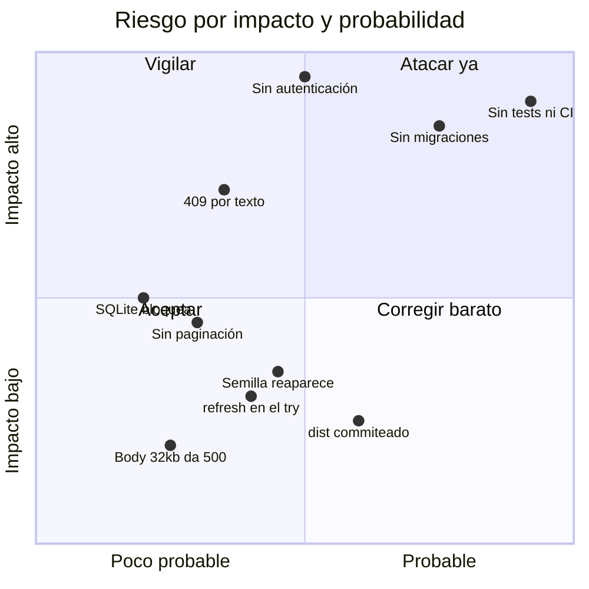

# Riesgos y deuda técnica

Ordenado por **qué rompería primero**. Cada punto apunta a dónde se origina y qué lo resolvería.

## Riesgo 1 — Sin tests ni pipeline · **alto / probable**

Ningún cambio tiene red de seguridad. Es la causa raíz de que los demás riesgos no se detecten solos.
→ [[CI-CD]], [[Roadmap y backlog]] #1 y #2.

## Riesgo 2 — Sin migraciones de esquema · **alto**

El único camino para cambiar la tabla es **borrar la base**. Bloquea cualquier evolución del modelo fuera de local.
→ [[ADR-001 node sqlite sin ORM]], [[Modelo de datos]].

## Riesgo 3 — El 409 depende del texto de un mensaje · **alto si ocurre**

`isUniqueConflict` busca la palabra `"unique"` en el mensaje de error de `node:sqlite`, que es una API **experimental**. Si cambia la redacción, los duplicados pasan de un 409 claro a un 500 genérico, y nada lo detecta.
→ [[ADR-005 Conflicto de email detectado por texto]]. **Mitigación más barata del vault: un test de integración.**

## Riesgo 4 — Sin autenticación · **crítico fuera de localhost**

Bajo el modelo actual (local, un usuario) es aceptable. En cuanto se exponga a una red, es un CRUD abierto sobre datos personales.
→ [[Seguridad]].

## Riesgo 5 — `refresh()` dentro del `try` · **medio / bajo impacto**

Si la mutación funciona pero el `GET` posterior falla, la UI muestra un toast de **error** aunque el dato se guardó. Además la lista queda desactualizada.
→ [[App estado]], [[ADR-003 Refrescar la lista tras cada mutación]]. Arreglo: sacar `refresh()` a su propio `try/catch`.

## Riesgo 6 — La semilla reaparece · **medio**

Vaciar el directorio a propósito y reiniciar repuebla los 4 contactos de ejemplo, porque la condición es "tabla vacía", no "primera vez".
→ [[Módulo db]]. Arreglo: una marca de "ya sembrado" en una tabla de metadatos.

## Riesgo 7 — Sin paginación · **medio, crece solo**

`GET /api/contacts` devuelve **todo** y el filtro es en cliente. Con decenas de filas es óptimo; con miles, la respuesta y el render se degradan a la vez.
→ [[Contrato de API]], [[Roadmap y backlog]] #10.

## Riesgo 8 — SQLite síncrono bloquea el event loop · **bajo hoy**

Cada consulta detiene el proceso. A esta escala son microsegundos; con consultas pesadas o concurrencia real, se nota en todas las peticiones a la vez.
→ [[ADR-001 node sqlite sin ORM]].

## Riesgo 9 — `frontend/dist/` versionado · **bajo, pero garantizado**

Un build commiteado terminará por no corresponder al fuente. Decidir: ignorarlo o regenerarlo en el pipeline.
→ [[Build y despliegue]].

## Deuda menor, arreglos baratos

| Deuda | Dónde | Arreglo |
|---|---|---|
| Body > 32 kB responde 500 en vez de 413 | [[Servidor Express]] | manejar el error de `express.json` |
| `catch` del 409 duplicado en `POST` y `PUT` | [[Módulo contacts]] | extraer un helper (mejor con tests antes) |
| Errores de formulario sin `aria-describedby` | [[ContactForm]] | asociar mensaje e input |
| La búsqueda ignora `notas` y `telefono` | [[App estado]] | una línea en el `useMemo` |
| 404 durante edición → toast genérico | [[App estado]] | salir del modo edición y refrescar |
| Sin índice en `nombre` | [[Modelo de datos]] | `CREATE INDEX` cuando importe |
| Sin timeouts en `fetch` | [[Cliente API]] | `AbortController` |
| La forma del contacto vive en 5 sitios | varios | consecuencia asumida de [[ADR-001 node sqlite sin ORM]] |

## Lo que NO es deuda

Se decidió así y funciona: sin router, sin librería de estado, sin ORM, sin CSS framework, CRUD síncrono. Añadir cualquiera de esas piezas hoy sería ceremonia, no mejora. Ver [[Roadmap y backlog]] § *Explícitamente descartado*.

Relacionado: [[CI-CD]], [[Seguridad]], [[Métricas y KPIs]].
