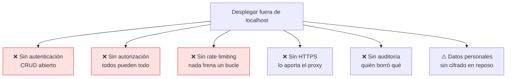

# Seguridad

> [!info] Modelo de amenaza actual
> Archivo está pensado para **localhost, un solo usuario de confianza**. Bajo ese supuesto las decisiones son razonables. Fuera de él, varias se vuelven inaceptables — y están marcadas abajo.

## Lo que está bien resuelto

**Sin inyección SQL.** Los cinco statements usan parámetros vinculados (`?`); en ningún punto se interpola una cadena dentro del SQL. Es estructural, no disciplinar: no hay un camino por donde colar SQL. Ver [[ADR-004 Statements preparados a nivel de módulo]].

**Validación en el servidor, no en el navegador.** El formulario usa `noValidate` a propósito: el cliente no valida nada de verdad. Toda entrada pasa por [[Validación y normalización]], que además tolera cualquier basura sin lanzar.

**Sin fuga de errores internos.** El handler final de [[Servidor Express]] loguea el error real y devuelve `"Error interno del servidor"`. El cliente nunca ve stacks ni rutas.

**Límite de cuerpo.** `express.json({ limit: "32kb" })` acota el payload.

**CORS restringido.** Solo `localhost:5173` y `127.0.0.1:5173`.

**Superficie mínima.** Cuatro dependencias directas en total entre los dos proyectos: poco que auditar, poco que se pudra.

**XSS por defecto.** React escapa el contenido; no hay `dangerouslySetInnerHTML` en ninguna parte.

## Lo que falta — bloqueante fuera de localhost

| Hueco | Consecuencia | Dónde se arregla |
|---|---|---|
| **Sin autenticación** | Cualquiera con acceso de red lee y borra todo el directorio | ítem #9 del [[Roadmap y backlog]] |
| **Sin autorización** | No hay roles; ver [[Personas y usuarios]] | junto con la autenticación |
| **Sin rate limiting** | Un bucle puede llenar la base o bloquear el event loop (SQLite es síncrono) | `express-rate-limit` en [[Servidor Express]] |
| **Sin cabeceras de seguridad** | Falta `helmet`: sin CSP, sin `X-Content-Type-Options` | [[Servidor Express]] |
| **Sin auditoría** | `updated_at` dice *cuándo*, nunca *quién*. RN-08 es irreversible | ítem #12 |
| **Datos personales sin cifrar** | Nombres, emails y teléfonos en un archivo plano en disco | cifrado de volumen + backups |
| **Body > 32 kB → 500** | Debería ser 413; hoy se confunde con un fallo del servidor | [[Servidor Express]] |

## Nota sobre datos personales

El contenido —nombre, email, teléfono, cargo— **es dato personal**. Aunque el proyecto sea un ejemplo, si se carga con un directorio real aplican obligaciones de tratamiento: base legal, retención, derecho de supresión (RN-08 lo cumple de forma brutal: borra de verdad) y acceso restringido. Nada de eso está implementado.

## Antes de exponerlo a una red

1. Autenticación.
2. HTTPS en el proxy.
3. `helmet` + rate limiting.
4. Backups del `.db`.
5. Revisar CORS con los orígenes reales.

Relacionado: [[Build y despliegue]], [[Riesgos y deuda técnica]], [[Contrato de API]].
