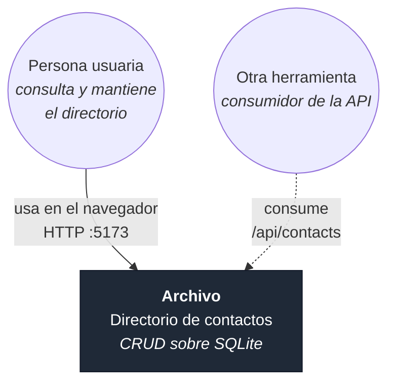
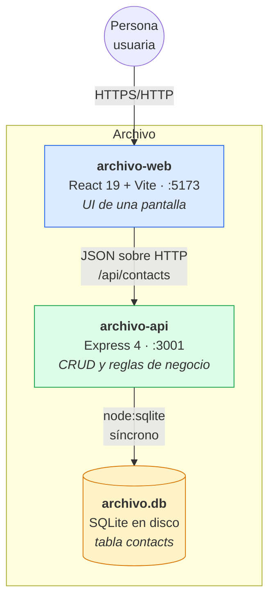
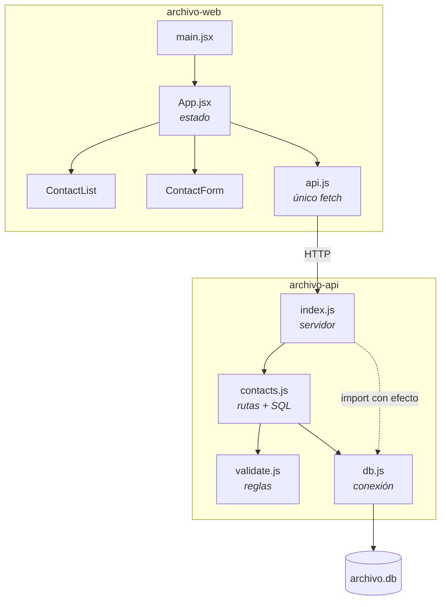

# Diagrama de contexto

Modelo C4, niveles 1 y 2.

## Nivel 1 — Contexto del sistema

Archivo no se integra con ningún sistema externo: no envía correos, no consulta directorios corporativos, no sincroniza con nada. Es deliberado ([[Visión de producto]]).

## Nivel 2 — Contenedores

| Contenedor | Responsabilidad | Nota |
|---|---|---|
| `archivo-web` | Presentar, buscar en cliente, capturar entrada | [[Frontend Web]] |
| `archivo-api` | Validar, aplicar reglas, persistir | [[Backend API]] |
| `archivo.db` | Guardar los contactos | [[Modelo de datos]] |

## Nivel 3 — Componentes

Notas por componente: [[App estado]] · [[ContactList]] · [[ContactForm]] · [[Cliente API]] · [[Servidor Express]] · [[Módulo contacts]] · [[Módulo validate]] · [[Módulo db]].

Relacionado: [[Arquitectura general]], [[Flujo de datos]], [[Mapa del grafo]].
