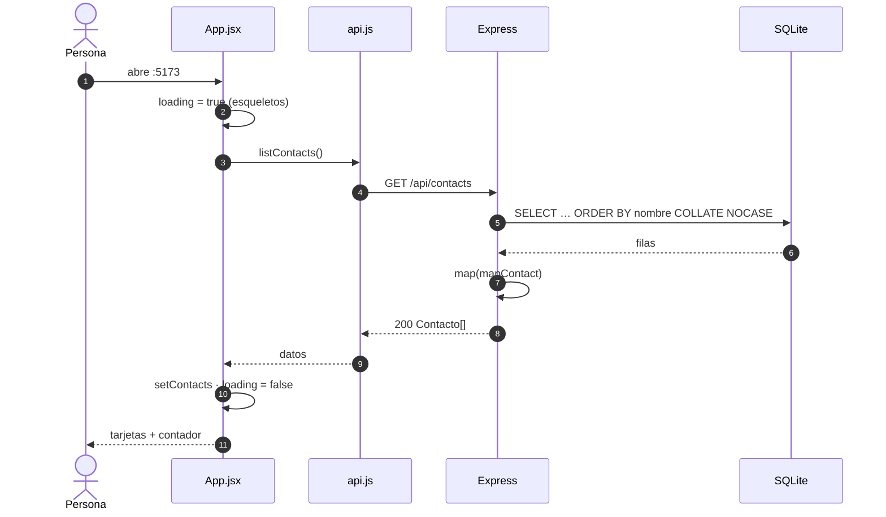
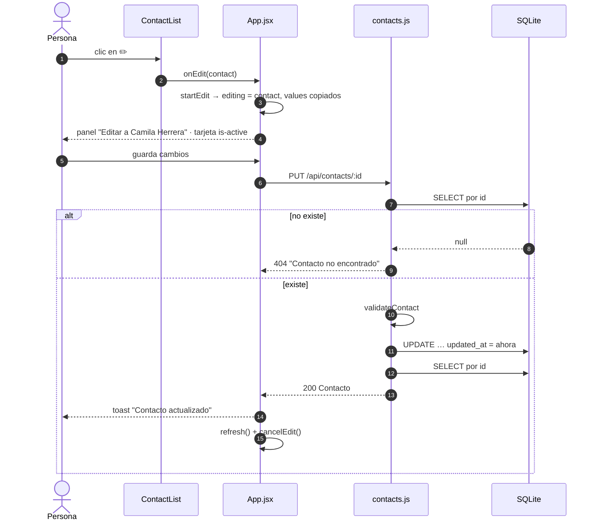
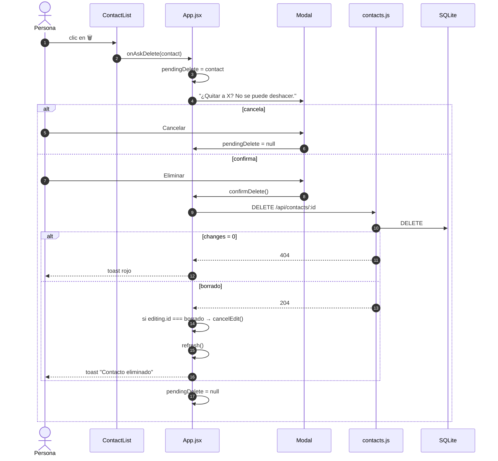

# Diagrama de secuencia

Los cuatro recorridos que importan, de la interacción al disco.

## Carga inicial

Si el `fetch` rechaza (backend caído), `setError` y se pinta el banner con *"¿Está corriendo el backend en el puerto 3001?"*.

## Crear un contacto

```mermaid
sequenceDiagram
    autonumber
    actor P as Persona
    participant F as ContactForm
    participant A as App.jsx
    participant C as api.js
    participant R as contacts.js
    participant V as validate.js
    participant D as SQLite

    P->>F: rellena y envía
    F->>A: handleSubmit
    A->>A: submitting = true
    A->>C: createContact(values)
    C->>R: POST /api/contacts
    R->>V: validateContact(body)

    alt inválido
        V-->>R: ok=false, errors
        R-->>C: 400 {error, errors}
        C-->>A: throw Error(.errors)
        A->>F: errores bajo cada campo
        A-->>P: toast rojo
    else válido
        V-->>R: ok=true, value (trim + minúsculas)
        R->>D: INSERT
        alt email duplicado
            D-->>R: UNIQUE constraint failed
            R->>R: isUniqueConflict → sí
            R-->>C: 409 {errors.email}
            C-->>A: throw
            A->>F: "Ese email ya está registrado"
        else ok
            D-->>R: lastInsertRowid
            R->>D: SELECT por id
            R-->>C: 201 Contacto
            C-->>A: contacto
            A-->>P: toast "Contacto creado"
            A->>C: refresh() → GET /api/contacts
            A->>A: cancelEdit()
        end
    end
    A->>A: submitting = false
```

La respuesta del `POST` **se descarta**: la lista se vuelve a leer entera ([[ADR-003 Refrescar la lista tras cada mutación]]).

## Editar un contacto

Orden deliberado: **existencia → validación → escritura** ([[Módulo contacts]]).

## Eliminar un contacto

Relacionado: [[Casos de uso]], [[Flujo de datos]], [[Contrato de API]], [[Estados de la UI]].
