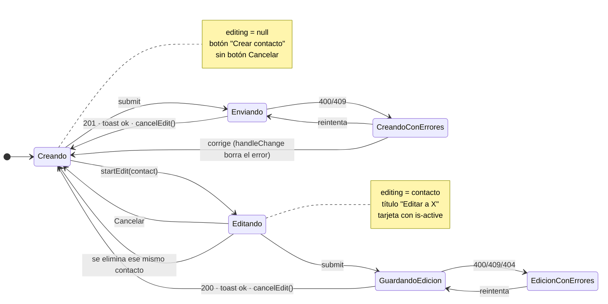
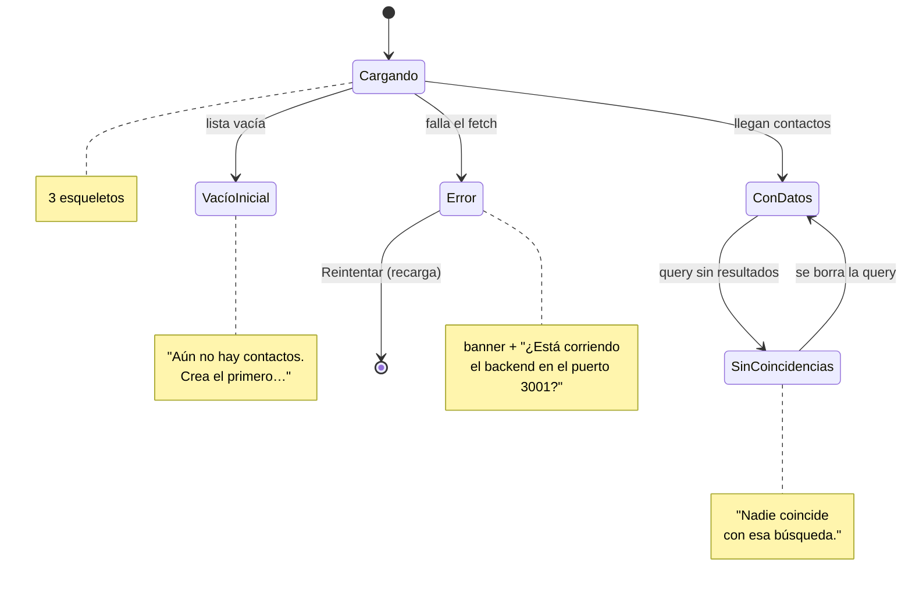
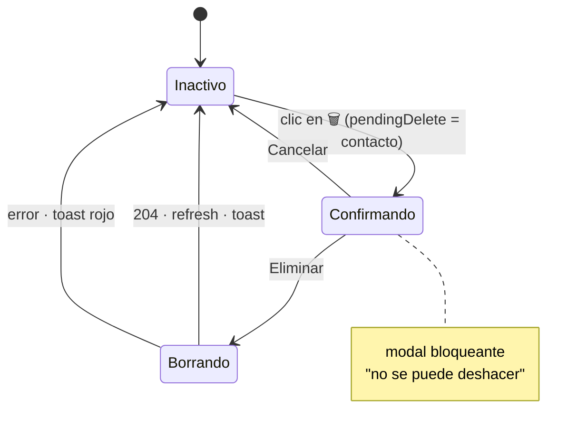
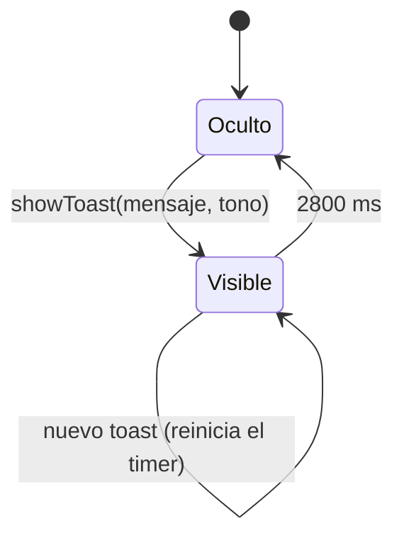

# Estados de la UI

## El formulario: un modo, una variable

`editing` (el contacto o `null`) es lo único que distingue crear de editar. No hay dos pantallas ni dos componentes.

Todo camino de salida termina en **Creando**, y todos pasan por el mismo `cancelEdit()`. Un solo reset, imposible que queden estados a medias.

## La lista: tres estados excluyentes

Distinguir *vacío inicial* de *sin coincidencias* importa: la acción que resuelve cada uno es distinta.

## El borrado: confirmación obligatoria

`pendingDelete` se limpia en un `finally`: el modal nunca se queda abierto, pase lo que pase.

## El toast

El `useEffect` limpia el `setTimeout` anterior al cambiar de toast, así que un aviso viejo nunca apaga a uno nuevo. Tonos `ok` (verde) y `err` (rojo), clases del [[Sistema visual]].

## Estados combinados posibles

| `loading` | `editing` | `pendingDelete` | Pantalla |
|---|---|---|---|
| sí | null | null | esqueletos + formulario vacío |
| no | null | null | reposo |
| no | contacto | null | edición, tarjeta resaltada |
| no | contacto | contacto | edición + modal (si se borra, sale de edición) |
| no | null | contacto | modal sobre reposo |

Relacionado: [[App estado]], [[ContactForm]], [[ContactList]], [[Casos de uso]].
