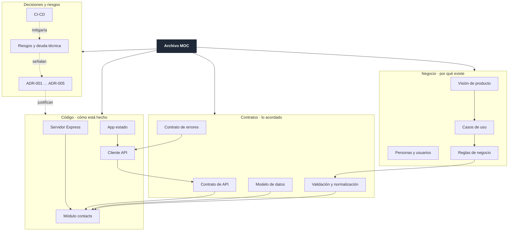

# Mapa del grafo

Cómo está tejido este vault y cómo leer la vista **Graph View** de Obsidian (`Ctrl/Cmd+G`).

## La topología

El grafo no es un árbol: es **una malla con cuatro capas** que se cruzan.

Los enlaces **sólidos** van de lo general a lo concreto. Los **punteados** cruzan capas: una decisión explica un módulo, un riesgo apunta a una decisión. Esos cruces son los que hacen útil el grafo.

## Nodos más conectados (los centros de gravedad)

| Nota | Papel |
|---|---|
| [[Archivo MOC]] | punto de entrada, enlaza con todo |
| [[Reglas de negocio]] | donde negocio y código se encuentran |
| [[Contrato de API]] | la frontera entre las dos apps |
| [[Módulo contacts]] | todo el SQL y todas las rutas |
| [[App estado]] | todo el estado del frontend |
| [[Riesgos y deuda técnica]] | recoge las consecuencias de los cinco ADR |

Si una nota nueva no enlaza con ninguna de estas, probablemente falta una conexión.

## Grupos de color sugeridos

Ya vienen configurados en `.obsidian/graph.json`. Si abres el vault en otra instalación, reprodúcelos en **Graph View → Groups**:

| Consulta | Color | Capa |
|---|---|---|
| `path:01-Negocio` | ámbar | negocio |
| `path:02-Arquitectura` | verde | arquitectura y contratos |
| `path:03-Componentes` | azul | código |
| `path:04-Operación` | morado | operación |
| `path:05-Diagramas` | rosa | diagramas |
| `tag:#riesgo` | rojo | atención |
| `tag:#pendiente` | gris | aún no existe en el repo |

## Consultas útiles en el grafo

- `tag:#pendiente` — todo lo que falta construir (tests, CI, auth, paginación).
- `tag:#adr` — las cinco decisiones y qué tocan.
- `tag:#contrato` — las cuatro fronteras del sistema.
- `-path:05-Diagramas` — ocultar diagramas para ver solo el contenido.

## Vista local

Con una nota abierta, la **Local Graph** a 2 saltos responde la pregunta "¿qué se rompe si cambio esto?". Pruébalo desde [[Módulo validate]]: aparecen las reglas de negocio, el contrato de errores, las rutas y el pipeline que debería protegerlo.

## Regla al añadir notas

Toda nota nueva enlaza **hacia arriba** (a su MOC o a su capa) y **hacia los lados** (a lo que toca). Una nota sin enlaces entrantes queda huérfana en el grafo y nadie la encuentra dos semanas después.

Relacionado: [[Cómo usar este vault]], [[Archivo MOC]], [[Diagrama de contexto]].
