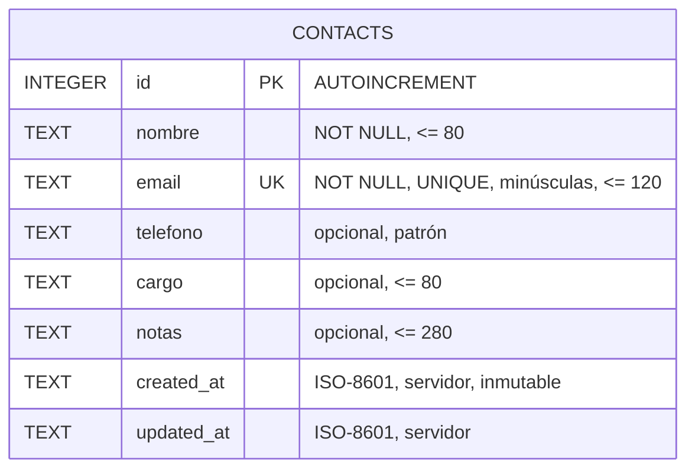
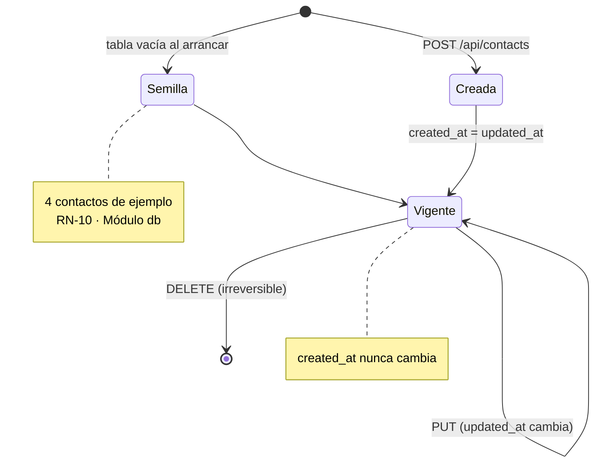
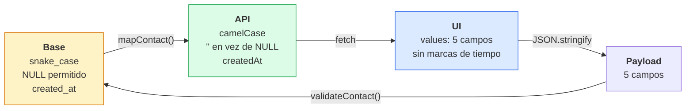

# Modelo ER

Una entidad, sin relaciones. El detalle de columnas y reglas está en [[Modelo de datos]].

## Entidad

## Ciclo de vida de una fila

`DELETE` es definitivo: no hay borrado lógico ni papelera (RN-08 en [[Reglas de negocio]]). Por eso la UI exige confirmación explícita.

## Las tres representaciones del mismo contacto

El ciclo es asimétrico a propósito: el cliente envía cinco campos y recibe ocho. `id`, `createdAt` y `updatedAt` los pone el servidor y el cliente no puede alterarlos (RN-09).

## Restricciones e índices

| Restricción | Tipo | Efecto al violarse |
|---|---|---|
| `id` PRIMARY KEY | implícita | — |
| `email` UNIQUE | implícita | → **409** vía [[ADR-005 Conflicto de email detectado por texto]] |
| `nombre` NOT NULL | columna | nunca se alcanza: el validador lo bloquea antes |
| `email` NOT NULL | columna | igual |

No hay índices explícitos. El `ORDER BY nombre COLLATE NOCASE` hace scan + sort; irrelevante a esta escala ([[Riesgos y deuda técnica]]).

Relacionado: [[Modelo de datos]], [[Módulo db]], [[Reglas de negocio]].
