# Archivo — Mapa de contenido

> [!abstract] Qué es Archivo
> Un **directorio de contactos** interno: alta, edición, búsqueda y baja de fichas de personas.
> Dos aplicaciones independientes —[[Frontend Web]] y [[Backend API]]— que solo se comunican por una API REST.

Este vault documenta el proyecto en dos ejes: **negocio** (para qué existe) y **técnico** (cómo está hecho).
Empieza por [[Cómo usar este vault]] si es tu primera vez.

## Mapa del proyecto

```mermaid
graph TD
    MOC["Archivo MOC"]

    MOC --> N["01 · Negocio"]
    MOC --> A["02 · Arquitectura"]
    MOC --> C["03 · Componentes"]
    MOC --> O["04 · Operación"]
    MOC --> D["05 · Diagramas"]

    N --> N1["Visión de producto"]
    N --> N2["Personas y usuarios"]
    N --> N3["Casos de uso"]
    N --> N4["Reglas de negocio"]
    N --> N5["Métricas y KPIs"]
    N --> N6["Roadmap y backlog"]

    A --> A1["Arquitectura general"]
    A --> A2["Backend API"]
    A --> A3["Frontend Web"]
    A --> A4["Modelo de datos"]
    A --> A5["Contrato de API"]
    A --> A6["ADR"]

    C --> C1["Módulos backend"]
    C --> C2["Componentes React"]

    O --> O1["Entorno de desarrollo"]
    O --> O2["CI-CD"]
    O --> O3["Riesgos y deuda técnica"]
    O --> O4["Estrategia de pruebas"]

    classDef raiz fill:#1f2937,stroke:#111827,color:#fff
    class MOC raiz
```

## 01 · Negocio

- [[Visión de producto]] — el problema, el alcance y lo que deliberadamente queda fuera
- [[Personas y usuarios]] — quién usa Archivo y con qué expectativa
- [[Casos de uso]] — los seis flujos que el producto soporta hoy
- [[Reglas de negocio]] — invariantes del dominio *contacto*
- [[Métricas y KPIs]] — qué mediríamos si esto fuera a producción
- [[Roadmap y backlog]] — lo siguiente, priorizado

## 02 · Arquitectura

- [[Arquitectura general]] — visión de 10.000 pies y por qué dos proyectos
- [[Backend API]] — Express 4 + `node:sqlite`
- [[Frontend Web]] — React 19 + Vite
- [[Modelo de datos]] — tabla `contacts` y su ciclo de vida
- [[Contrato de API]] — endpoints, payloads y códigos
- [[Contrato de errores]] — la forma única `{ error, errors }`
- [[Validación y normalización]] — la puerta de entrada de todo dato
- [[Flujo de datos]] — el recorrido de un dato de punta a punta
- ADR: [[ADR-001 node sqlite sin ORM]] · [[ADR-002 Dos proyectos sin monorepo]] · [[ADR-003 Refrescar la lista tras cada mutación]] · [[ADR-004 Statements preparados a nivel de módulo]] · [[ADR-005 Conflicto de email detectado por texto]]

## 03 · Componentes

**Backend** — [[Servidor Express]] · [[Módulo db]] · [[Módulo contacts]] · [[Módulo validate]]
**Frontend** — [[Cliente API]] · [[App estado]] · [[ContactForm]] · [[ContactList]] · [[Sistema visual]]

## 04 · Operación

- [[Entorno de desarrollo]] — cómo levantarlo en local
- [[Build y despliegue]] — qué existe y qué falta
- [[Estrategia de pruebas]] — 251 pruebas en tres capas y por qué cada una existe
- [[CI-CD]] — el pipeline de GitHub Actions; queda pendiente el linter
- [[Seguridad]] — CORS, límites de payload, superficie expuesta
- [[Riesgos y deuda técnica]] — lo que rompería primero

## 05 · Diagramas

- [[Mapa del grafo]] — cómo leer el grafo de Obsidian de este vault
- [[Diagrama de contexto]] — C4 nivel 1 y 2
- [[Diagrama de secuencia]] — crear, editar y borrar un contacto
- [[Modelo ER]] — entidad y campos
- [[Estados de la UI]] — máquina de estados del formulario

---

**Glosario rápido:** [[Glosario]]
